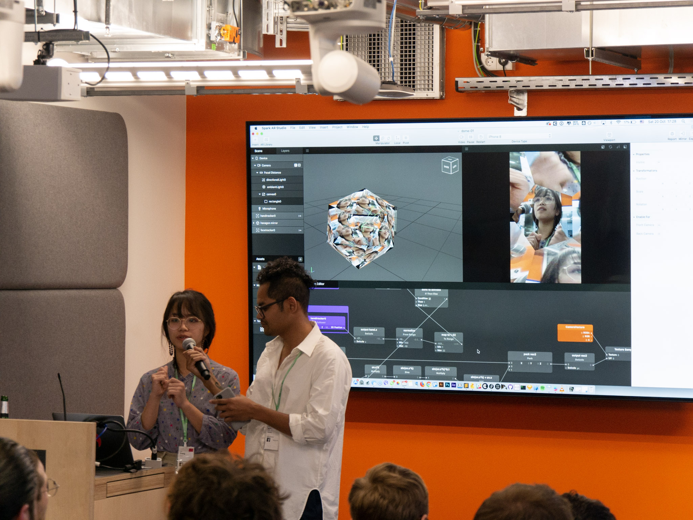
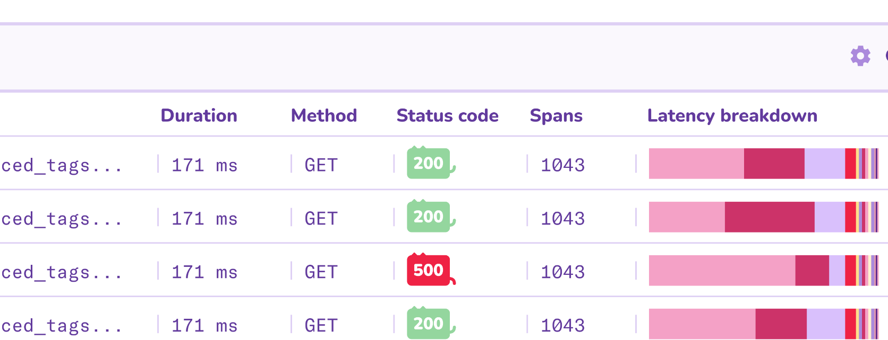
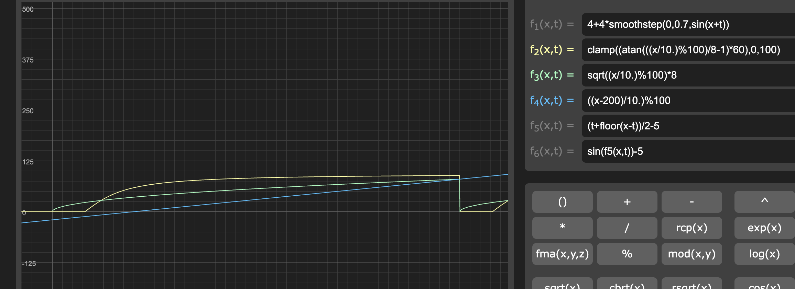

Side projects and hackathon are my favourites. I enjoy learning, tinkering with code, building tools just for the joy of it. Here are a few hackathons that I have participated in over the years since 2018.

---

**Hello Kitty Theme**<br>
Datadog internal hackathon, 2025

Wanting a refreshing departure from Datadog's traditional utilitarian look and feel, I gave the UI a makeover. This Hello Kitty theme introduced a soft pastel color palette, rounded corners and playful animations everywhere! 




---

**Bufo Emoji Generator** <br>
Datadog internal hackathon, 2025

A fun little website I built for generating custom [Bufo](https://knowyourmeme.com/memes/froge-worry-frog) slack emojis. I manually created the assets and vibecoded this in Cursor over a couple of days.

I started by downloading and scanning through [hundreds of Bufo emojis](https://github.com/knobiknows/all-the-bufo/blob/main/index.md) to find common patterns and create the assets. After that, I put together a simply UI to use as part of the prompt in Cursor.


Check it out 
::link{url="https://bufo-generator.pages.dev/"}

---

**Animating scatterplots with Vega-Lite** <br>
Datadog internal hackathon, 2024

In 2024, Datadog rolled out the support for [Vega-Lite](https://en.wikipedia.org/wiki/Vega_and_Vega-Lite_visualisation_grammars), an open-source visualization grammar that allows allows users to create graphs that are not available within the native Datadog widget and query system. I wasn't familiar with Vega-Lite before, and took the opportunity to dive in and learn.

The first animation I created was this [scatterplot of falling raindrops](https://vega.github.io/editor/#/url/vega-lite/N4IgJAzgxgFgpgWwIYgFwhgF0wBwqgegIDc4BzJAOjIEtMYBXAI0poHsDp5kTykBaADZ04JAKyUAVhDYA7EABoQOJACckCCGgDaoWRrhoQmGgkNK5O0HFKzMW1KEwBPHIfQmzqxcZiq22ILuAIwADAC+Sgw4ACZImO7GpnAAFLJsAO4pAJTZIOEAuoVKcZgojiDESIIMcA66IAAeRsEATJQAzKEA7N0+zkZdlKFiACzB+QqgzeitwcOtYgBs-UajAJyUS0vrYpPTRnMLy6uzS5StPev7TYOhlN07racgreeX3deRB+gdHZRiAAc6z6SgGZwB60WNxmIA65yhHQmYLW91GHUBfW+t3QowRrSRLwxAOCJ2xsLEoRewU2212MMO53GoQ6L0BlGChPJqJJrUB1PZYlJK256CW7UBlz2KNxEklfwZYrlING1IkI3GipAgNGHNCbxerVpOz2ou1-yBIKJ8zEUNNUxxIG6-x14utlBB3WeZpBHM+0pA4JAo26nSWwX5Zu6EjakpeS3ZnImZo2D3RKxlIDEcoJrLNHV1HVt8eN9LNby221BgaMS1D3Txqp9lFGmOemaWur5Gy1urCBszIbDEa1-x6OyJHK5DthwJbbZeurp9p+IDCY8e10zRsrZZnRnW522dfjOYVUfZeNJL2WFyuWsPLfXL19Dc7Wu69037Zr6E+u5XR1O06YtM0fD4vn3dBKTZeZPW9KCsyZZ9M26ODegQ1dRnuIU+TZM880Q0YJSlalQnueVCNXI4+TmNlBWFLU2gBTtkV-NdyOGMZk0QiRWLZC1GMKSJjHUWQIAAMzYVQECsEAoGqKAGEEeJEgAckAXg3AHKdtSfCQBwQEQNhJBoG4FMEJSVISFpyIAAgAalslJSgYBBKGcWz+FszxRDCUJslsgBSWy-Ic2yIBoWRnPiVz3NsgAqbzkgIPzyLyJR9KMBA2FIABNfICiUOBZCgNgYkisg0FAcFQAkmg4EEGIspyuB8qUFw3CMABHBgkDsOh4hoUgfGgap3FAGI2GQSKdFCBQ-KKESZlq+rGqMZp2tcRIer6kwyhMYaRIigAvcbKmqWo0EuESEkaTAqpAOqGqa9AjJMnwOsSdIEEi6p8hE5BVAAayMW77vCIA), using a simple dataset with about 40 points.Each point is represented with a 💧 emoji using Vega-Lite’s [text mark](https://vega.github.io/vega/docs/marks/text/).


To make the raindrops "fall", I added a timer. It updates every 10ms and is the time that passed since  the visualization loaded. 

```jsx
{
  "name": "time", 
     "on": [{"events": {"type": "timer", "throttle": 10}, "update": "now()"}] 
}
```

Using this timer, I updated the Y position of each raindrop with a combination of modulo (%) and sine to create looping vertical movement with some variation in speed:

```jsx
"transform": [
    {
      "calculate": "100 + (datum.y - time/100) % 100 + sin(datum.y * time/10000)",
      "as": "moveY"
    }
  ]
```
And voilà, animated rain. [View code.](https://vega.github.io/editor/#/url/vega-lite/N4IgJAzgxgFgpgWwIYgFwhgF0wBwqgegIDc4BzJAOjIEtMYBXAI0poHsDp5kTykBaADZ04JAKyUAVhDYA7EABoQOJACckCCGgDaoWRrhoQmGgkNK5O0HFKzMW1KEwBPHIfQmzqxcZiq22ILuAIwADAC+Sgw4ACZImO7GpnAAFLJsAO4pAJTZIOEAuoVKcZgojiDESIIMcA66IAAeRsEATJQAzKEA7N0+zkZdlKFiACzB+QqgzeitwcOtYgBs-UajAJyUS0vrYpPTRnMLy6uzS5StPev7TYOhlN07racgreeX3deRB+gdHZRiAAc6z6SgGZwB60WNxmIA65yhHQmYLW91GHUBfW+t3QowRrSRLwxAOCJ2xsLEoRewU2212MMO53GoQ6L0BlGChPJqJJrUB1PZYlJK256CW7UBlz2KNxEklfwZYrlING1IkI3GipAgNGHNCbxerVpOz2ou1-yBIKJ8zEUNNUxxIG6-x14utlBB3WeZpBHM+0pA4JAo26nSWwX5Zu6EjakpeS3ZnImZo2D3RKxlIDEcoJrLNHV1HVt8eN9LNby221BgaMS1D3Txqp9lFGmOemaWur5Gy1urCBszIbDEa1-x6OyJHK5DthwJbbZeurp9p+IDCY8e10zRsrZZnRnW522dfjOYVUfZeNJL2WFyuWsPLfXL19Dc7Wu69037Zr6E+u5XR1O06YtM0fD4vn3dBKTZeZPW9KCsyZZ9M26ODegQ1dRnuIU+TZM880Q0YJSlalQnueVCNXI4+TmNlBWFLU2gBTtkV-NdyOGMZk0QiRWLZC1GMKSJjHUWQIAAMzYVQECsEAoGqKAGEEeJEgAckAXg3AHKdtSfCQBwQEQNhJBoG4FMEJSVISFpyIAAgAalslJSgYBBKGcWz+FszxRDCUJslsgBSWy-Ic2yIBoWRnPiVz3NsgAqbzkgIPzyLyJR9KMBA2FIABNfICiUOBZCgNgYkisg0FAcFQAkmg4EEGIspyuB8qUFw3CMABHBgkDsOh4hoUgfGgap3FAGI2GQSKdFCBQ-KKESZlq+rGqMZp2tcRIer6kwyhMYaRIigAvcbKmqWo0EuESEkaTAqpAOqGqa9AjJMnwOsSdIEEi6p8hE5BVAAayMW77vCIA)


##### Other animations

After that, I experimented with other animations, each using similar principles with different mathematical functions. I used [Graphtoy](https://graphtoy.com/?f1(x,t)=4%20+%204*smoothstep(0,0.7,sin(x+t))&v1=false&f2(x,t)=clamp((atan(((x/10.)%25100)/8-1)*60),%200,%20100)&v2=true&f3(x,t)=sqrt((x/10.)%25100)%20*%208&v3=true&f4(x,t)=((x%20-%20200)/10.)%25100&v4=true&f5(x,t)=(t%20+%20floor(x-t))/2%20-%205&v5=false&f6(x,t)=sin(f5(x,t))%20-%205&v6=false&grid=1&coords=521.7855192792142,66.89164551771165,597.4221734999295) to test and visualise the motion path. In the examples below, I created the motion that mimic balls being thrown and bouncing off the ground. Instead of just vertical motion, the points now move along parabolic paths.




##### Cross-graph animation

I also experimented with creating cross-graph animations. The idea was to split a single animation across multiple graphs in the same dashboard, so it looks like an object moves from one graph to another.


Initially, I tried to get the graphs within a dashboard to talk to each other, which is possible but requires more work. In the end, I opted for a simpler approach. Each graph renders a different segment of the animation’s X-axis. When loaded together, they appear as one continuous animation spread across panels.

Timing was critical as the effect only works if all graphs load simultaneously, which thankfully they did during my demo.


##### Putting it all together


---

**P5.js Posenet as MIDI Controller** <br>
Ableton internal hackathon, 2022


::link{url="https://bufo-generator.pages.dev/"}
