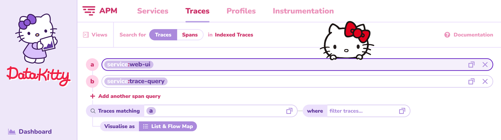
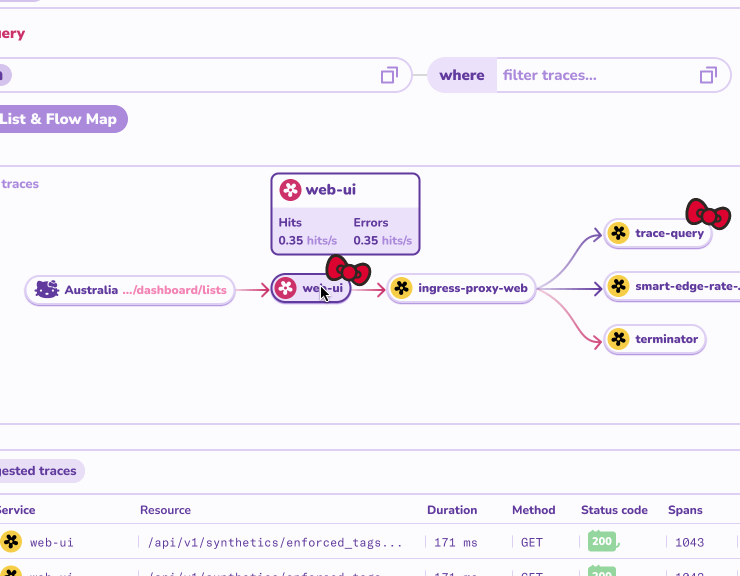
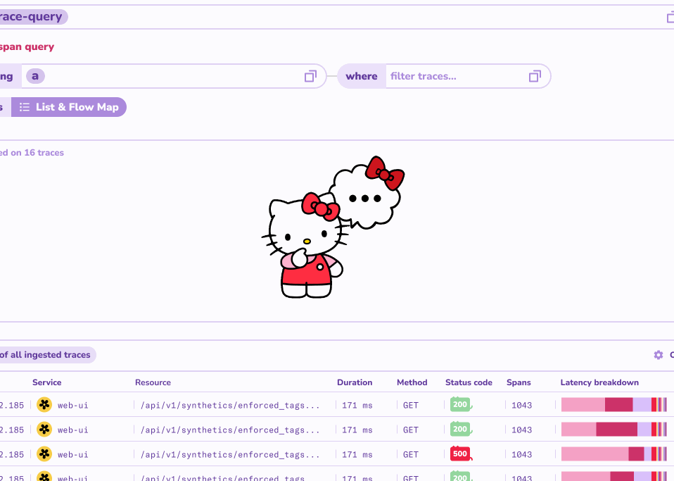

As part of an internal company hackathon, I gave Datadog a makeover by rebranding it with a Hello Kitty theme. This new look introduced a soft pastel color palette, rounded corners and animations everywhere. A refreshing departure from the tool's traditional utilitarian look and feel.

### Reaction

The response was overwhelming: everyone smiled when they saw it. Many said it would actually make them want to spend more time in Datadog, with some colleagues suggesting that this theme could boost morale and productivity if it was implemented. One teammate printed the logo as stickers, which quickly spread across laptops in the office :-). 

