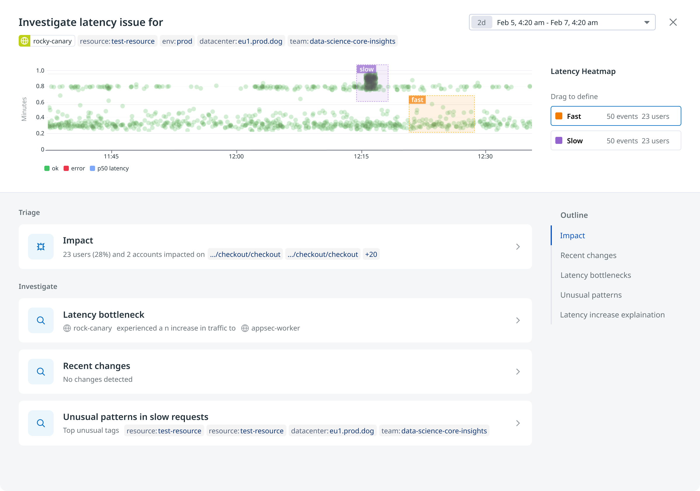
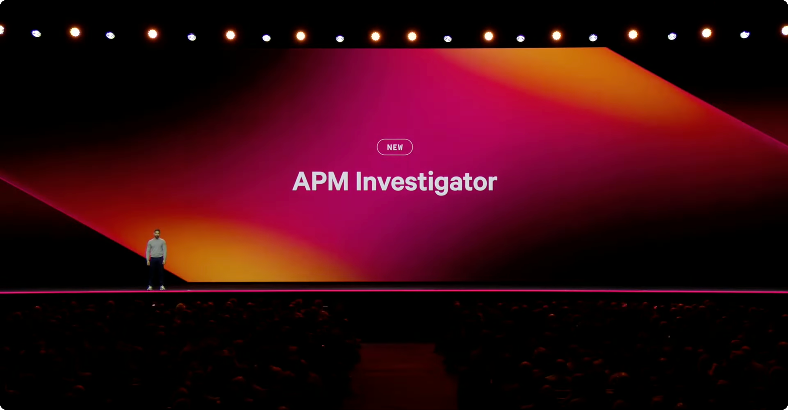

Application Performance Monitoring (APM) is a core product offering from Datadog, generating over $500M ARR for the company. 

Since joining the team, I have been leading product design of some of APM’s most valuable initiatives, including [Trace Queries (2023-2024)](https://www.youtube.com/live/GjcLWupY0jk?t=3574s), [Change Tracking (2024)](https://www.youtube.com/live/ZMNXNH-kJAM?feature=shared&t=4840), [Recommendations (2025)](https://www.youtube.com/live/FW8_RoDxnpc?feature=shared&t=2092), and most recently, [Latency Investigator (2025)](https://www.youtube.com/live/FW8_RoDxnpc?feature=shared&t=1948). 

---

##### Latency Investigator

In December 2024, I proposed a product initiative to address a common customer pain point: difficulty in troubleshooting latency issue (despite Datadog having the right tools). I wrote a document describing the concept and this was later adopted as a formal OKR and became the APM flagship projects for the year. A demo was [showcased](https://www.youtube.com/live/FW8_RoDxnpc?t=1948s) at Dash, the company's yearly announcement and continues to be developed by a dedicated squad as of Q4 2025.

##### Impact
- Led the product design strategy and execution from initial concept to private beta launch
- Successfully demoed publicly, became the most adopted feature from company's yearly announcement
- Over 2,000 investigations were initiated in the past month, a strong signal of adoption, especially given the feature is in private beta and limited to just 232 organizations
- (find out how many people opted in, find better numbers, )
- From 0 to 232 org in 2 months, with 90% CSAT score

#####
- Led the entire design process end-to-end, including strategy, user research, design execution, and post-launch evaluation. 
- Collaborated closely with a cross-functional team of 30+ including PMs, TPMs, Senior/Staff+ Engineers, and Engineering Managers.
- The work underwent multiple rounds of review with VPs of Engineering, Product, and Design prior to launch

##### Scope & Impact
- 6 months from concept to private beta 
- (thought about this problem for a long time, made the work easier by working on trace groups, change tracking, tag analysis)
- Cross team enabled future features and collaborations

##### Milestones
- 5 months from concept to Private Beta

**🎥 Live Demo**

::link{url="https://www.youtube.com/live/FW8_RoDxnpc?feature=shared&t=1948"}

Across the team, I'm known for consistently taking complex and ambiguous product ideas to key workflows that ship in production. These are all projects that require deep technical knowledge, cross-team coordination, and challenging stakeholder management

While AI led, was the goal, we realise the value of human to provide context, .. the best way to put good AI powered products is by giving human really good tools to guide those pr
- decouple triaging signals 
- there are different steps before letting AI take over (some sort oof contextualisation)
- the data is imperfect, we don't rly know what ppl care about, 
- help human do the right thing w their data