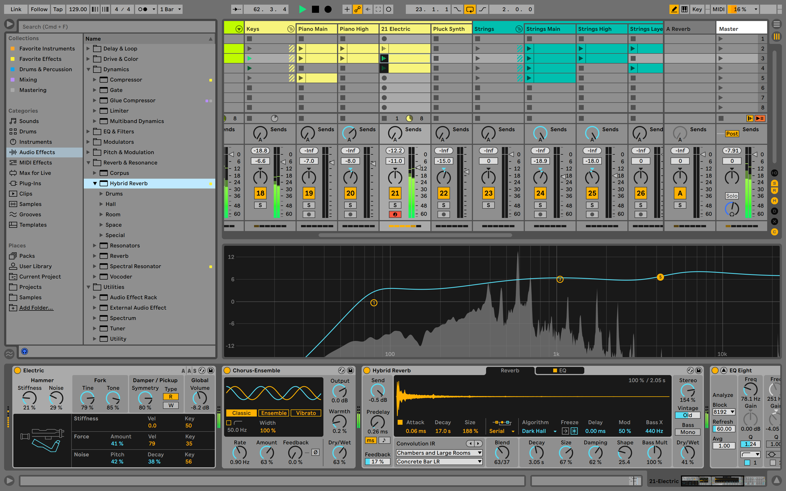
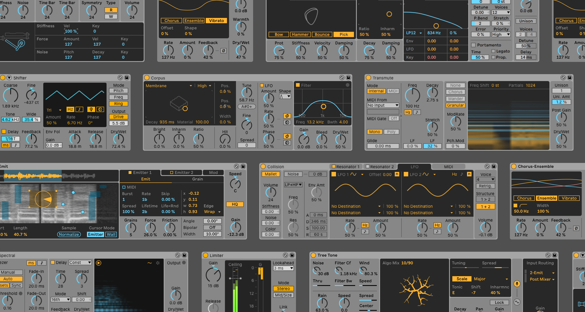
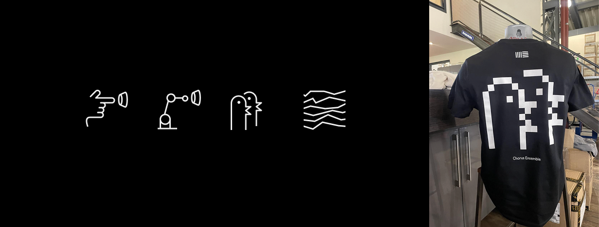
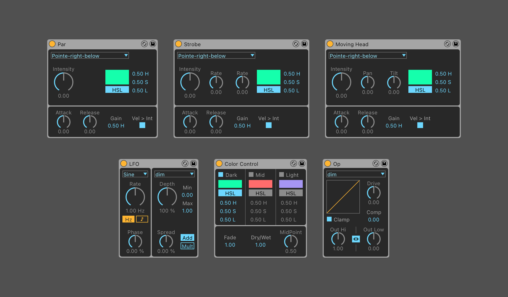
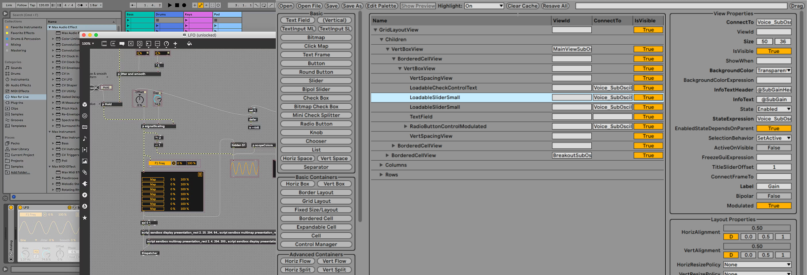

From 2019 to 2022, I worked as a designer in the Sound department at Ableton, where I focused on crafting interfaces for instruments and audio effects within Ableton Live. This is the company's flagship music production software that has shaped music culture for over two decades. The Sound team that I was part of is responsible for developing the instruments and effects that power Ableton’s ecosystem of creative tools.

**Role** 
UX/UI Design

A collection of devices I designed for [Ableton Live 11](https://www.productionmusiclive.com/blogs/news/whats-new-in-ableton-live-11-all-new-features-of-live-11-explained-and-demonstrated?srsltid=AfmBOopwbNzLd_2g0QE526Pj2_Js3gtmmRRyTjNcLs82_XMkLbp3xObu), in close collaboration with Product Owner & Sound Designer, [Christian Kleine](https://en.wikipedia.org/wiki/Christian_Kleine). Check out this [tutorial](https://www.youtube.com/watch?v=sA76L_2xC8Q"}) to learn more about one of the synths I helped redesign called Collision. 

---

##### Icons designed for [Push, Ableton's hardware controller](https://www.ableton.com/en/push/)

---

##### Beam by Showsync
User interface design for devices and effects for [Beam by Showsync](https://beam.showsync.com/), a lighting solution for Ableton Live. The engine turns Live into a [lighting console](https://www.youtube.com/watch?v=mhyqtEIBU2I) by allowing users to control lighting instruments with MIDI notes.

---

##### Frontend Development
Alongside my design work, I took the initiative to implement some of my designs using [Max/MSP](https://www.ableton.com/en/live/max-for-live/) and a low-code internal tool. I have also led workshops and taught other designers to use these tools, empowering them to confidently make minor frontend fixes on their own.

