In December 2024, I participated in a Datadog internal hackathon and built a series of fun, animated graphs inside Datadog dashboards using [Vega-Lite](https://vega.github.io/). 

At the time, Datadog just introduced the integration with Vega-Lite, an open-source visualization tool implementing a grammar of graphics. This allows users to create graphs that are not available within the native Datadog widget and query system. I wasn't familiar with [Vega or Vega-Lite](https://en.wikipedia.org/wiki/Vega_and_Vega-Lite_visualisation_grammars) prior to this and took this opportunity to learn its grammar. 

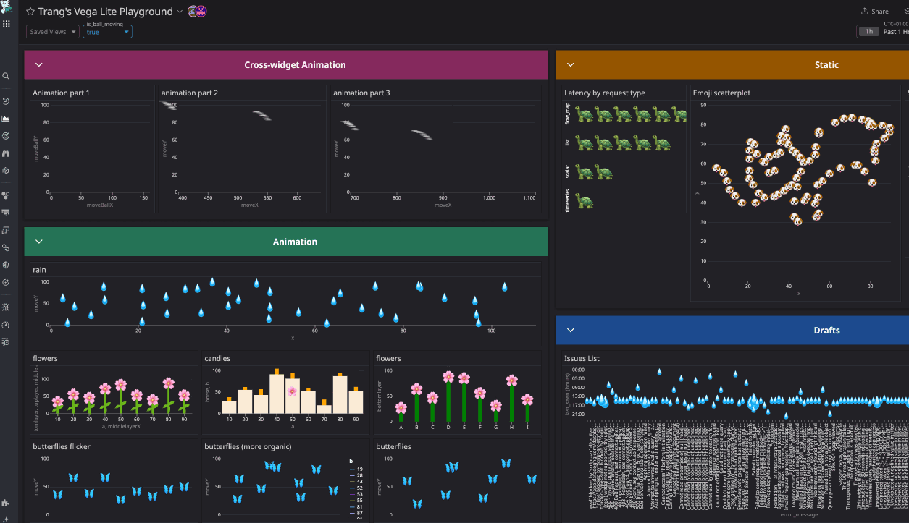

This [moving rain drop scatterplot.](https://vega.github.io/editor/#/url/vega-lite/N4IgJAzgxgFgpgWwIYgFwhgF0wBwqgegIDc4BzJAOjIEtMYBXAI0poHsDp5kTykBaADZ04JAKyUAVhDYA7EABoQOJACckCCGgDaoWRrhoQmGgkNK5O0HFKzMW1KEwBPHIfQmzqxcZiq22ILuAIwADAC+Sgw4ACZImO7GpnAAFLJsAO4pAJTZIOEAuoVKcZgojiDESIIMcA66IAAeRsEATJQAzKEA7N0+zkZdlKFiACzB+QqgzeitwcOtYgBs-UajAJyUS0vrYpPTRnMLy6uzS5StPev7TYOhlN07racgreeX3deRB+gdHZRiAAc6z6SgGZwB60WNxmIA65yhHQmYLW91GHUBfW+t3QowRrSRLwxAOCJ2xsLEoRewU2212MMO53GoQ6L0BlGChPJqJJrUB1PZYlJK256CW7UBlz2KNxEklfwZYrlING1IkI3GipAgNGHNCbxerVpOz2ou1-yBIKJ8zEUNNUxxIG6-x14utlBB3WeZpBHM+0pA4JAo26nSWwX5Zu6EjakpeS3ZnImZo2D3RKxlIDEcoJrLNHV1HVt8eN9LNby221BgaMS1D3Txqp9lFGmOemaWur5Gy1urCBszIbDEa1-x6OyJHK5DthwJbbZeurp9p+IDCY8e10zRsrZZnRnW522dfjOYVUfZeNJL2WFyuWsPLfXL19Dc7Wu69037Zr6E+u5XR1O06YtM0fD4vn3dBKTZeZPW9KCsyZZ9M26ODegQ1dRnuIU+TZM880Q0YJSlalQnueVCNXI4+TmNlBWFLU2gBTtkV-NdyOGMZk0QiRWLZC1GMKSJjHUWQIAAMzYVQECsEAoGqKAGEEeJEgAckAXg3AHKdtSfCQBwQEQNhJBoG4FMEJSVISFpyIAAgAalslJSgYBBKGcWz+FszxRDCUJslsgBSWy-Ic2yIBoWRnPiVz3NsgAqbzkgIPzyLyJR9KMBA2FIABNfICiUOBZCgNgYkisg0FAcFQAkmg4EEGIspyuB8qUFw3CMABHBgkDsOh4hoUgfGgap3FAGI2GQSKdFCBQ-KKESZlq+rGqMZp2tcRIer6kwyhMYaRIigAvcbKmqWo0EuESEkaTAqpAOqGqa9AjJMnwOsSdIEEi6p8hE5BVAAayMW77vCIA) was one of the first that was made, which then led to me creating the rest of the dashboard as shown in the gif above.
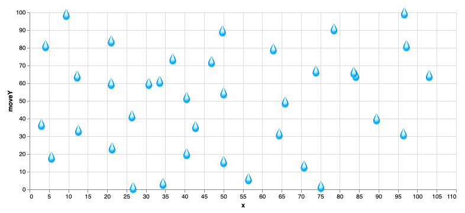

## Get the data
For the rain drops, I use a very simple dataset with about 40 points that looks like this. 

| x    | y   | 
| -------- | -------- | 
|12.3077|   30.0541|
|21.0256| 49.6695|
|21.0256| 26.2079|
|30.7692|26.2079|
|33.5897|26.5925|

The 💧 emoji is used as a [text mark](https://vega.github.io/vega/docs/marks/text/) for each point. 

```
"transform": [
    {
      "calculate": "'💧'",
      "as": "emoji"
    }
],
"mark": "text"
"encoding": {
    "x": {"type": "quantitative"},
    "y": {"type": "quantitative"},
    "size": {"value": 20},
    "text": {
      "field": "emoji",
      "type": "nominal"
    }
},
```
Putting it together and you get this nice static rain graph. 

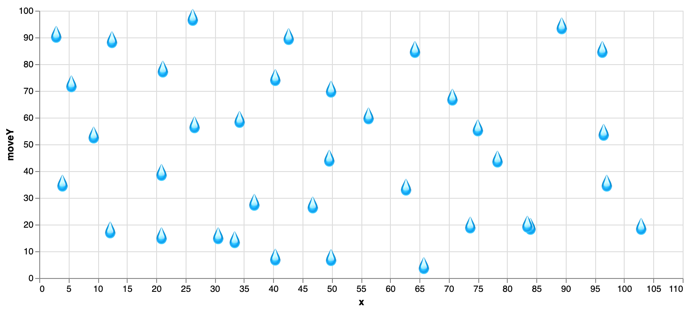

## Animating the points
In order to move the point, I got a timer in Vega-Lite. This timer update every 10ms and is the time that passed since startup. There will be an underline in the editor but you can ignore it.

```jsx
{
  "name": "time", 
     "on": [{"events": {"type": "timer", "throttle": 10}, "update": "now()"}] 
}
```

Each point is moved by passing the timer variable and using the modulo(%) operator in order to loop and move each point from the top to the bottom of the screen and back. I added a sine wave on top to introduce a bit of variety in speed.

```jsx
"transform": [
    {
      "calculate": "100 + (datum.y - time/100) % 100 + sin(datum.y * time/10000)",
      "as": "moveY"
    }
  ]
```
That's pretty much it! This is the result. The code [is available here.](https://vega.github.io/editor/#/url/vega-lite/N4IgJAzgxgFgpgWwIYgFwhgF0wBwqgegIDc4BzJAOjIEtMYBXAI0poHsDp5kTykBaADZ04JAKyUAVhDYA7EABoQOJACckCCGgDaoWRrhoQmGgkNK5O0HFKzMW1KEwBPHIfQmzqxcZiq22ILuAIwADAC+Sgw4ACZImO7GpnAAFLJsAO4pAJTZIOEAuoVKcZgojiDESIIMcA66IAAeRsEATJQAzKEA7N0+zkZdlKFiACzB+QqgzeitwcOtYgBs-UajAJyUS0vrYpPTRnMLy6uzS5StPev7TYOhlN07racgreeX3deRB+gdHZRiAAc6z6SgGZwB60WNxmIA65yhHQmYLW91GHUBfW+t3QowRrSRLwxAOCJ2xsLEoRewU2212MMO53GoQ6L0BlGChPJqJJrUB1PZYlJK256CW7UBlz2KNxEklfwZYrlING1IkI3GipAgNGHNCbxerVpOz2ou1-yBIKJ8zEUNNUxxIG6-x14utlBB3WeZpBHM+0pA4JAo26nSWwX5Zu6EjakpeS3ZnImZo2D3RKxlIDEcoJrLNHV1HVt8eN9LNby221BgaMS1D3Txqp9lFGmOemaWur5Gy1urCBszIbDEa1-x6OyJHK5DthwJbbZeurp9p+IDCY8e10zRsrZZnRnW522dfjOYVUfZeNJL2WFyuWsPLfXL19Dc7Wu69037Zr6E+u5XR1O06YtM0fD4vn3dBKTZeZPW9KCsyZZ9M26ODegQ1dRnuIU+TZM880Q0YJSlalQnueVCNXI4+TmNlBWFLU2gBTtkV-NdyOGMZk0QiRWLZC1GMKSJjHUWQIAAMzYVQECsEAoGqKAGEEeJEgAckAXg3AHKdtSfCQBwQEQNhJBoG4FMEJSVISFpyIAAgAalslJSgYBBKGcWz+FszxRDCUJslsgBSWy-Ic2yIBoWRnPiVz3NsgAqbzkgIPzyLyJR9KMBA2FIABNfICiUOBZCgNgYkisg0FAcFQAkmg4EEGIspyuB8qUFw3CMABHBgkDsOh4hoUgfGgap3FAGI2GQSKdFCBQ-KKESZlq+rGqMZp2tcRIer6kwyhMYaRIigAvcbKmqWo0EuESEkaTAqpAOqGqa9AjJMnwOsSdIEEi6p8hE5BVAAayMW77vCIA)


## Other animations

The other animations were created similarly. For visualising and testing different shaping functions, I used [Graphtoy](https://graphtoy.com/?f1(x,t)=4%20+%204*smoothstep(0,0.7,sin(x+t))&v1=false&f2(x,t)=clamp((atan(((x/10.)%25100)/8-1)*60),%200,%20100)&v2=true&f3(x,t)=sqrt((x/10.)%25100)%20*%208&v3=true&f4(x,t)=((x%20-%20200)/10.)%25100&v4=true&f5(x,t)=(t%20+%20floor(x-t))/2%20-%205&v5=false&f6(x,t)=sin(f5(x,t))%20-%205&v6=false&grid=1&coords=521.7855192792142,66.89164551771165,597.4221734999295). In the examples below, instead of having the points moving from top to bottom, the movement mimics the motion of a ball being thrown from different angles and bouncing off the floor.

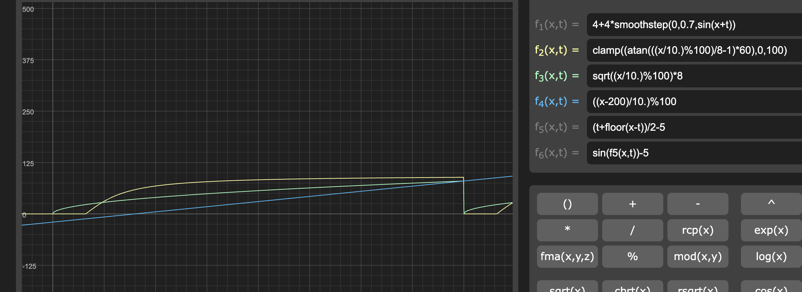

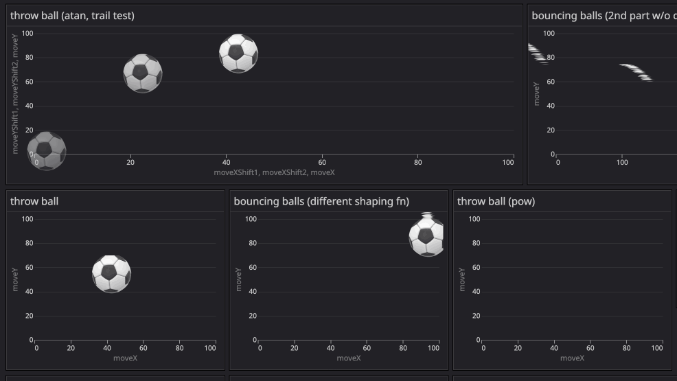

Another animation using flower and leaf emojis to create a garden. [View code.](https://vega.github.io/editor/#/url/vega-lite/N4IgJAzgxgFgpgWwIYgFwhgF0wBwqgegIDc4BzJAOjIEtMYBXAI0poHsDp5kTykBaADZ04JAKyUAVhDYA7EABoQAEzjQATjRyZ289AEEABBBoIcguIaZJ1h2DcyGA7nRiHETOMtXLDypJhUiiAuyvRoIFBygTSycOrBODZICBBoANqgsilwEToIuUpyGaBwpLKYaaigmACeOLno+fHB9Ops2BZoAIwADAC+Sgw4-piNIM0AFLJsTpMAlPMg-QC6q0qjKNUgxEiCDGolIFsgfcFMaADMAEyDoCfXvedoYmJ3xxGXT0oXqAAsl3eJz+3xAvwA7N0gRExKDfgAOKEKe4RABscJegORH3Q4IxqEuAE5oeh4fj4eCSSBCfixLc1kpMOokLIIAAzNjqBBHKB7KAMQQBcajBgIShMQwAakMk0mJlkkxFYolACoZc0CH1er1KPNDGqdd09QRDNc9WrLkslEgqhM2OYkLUWu9eYJ+YKxhEleKVTrrlLTcEbREEDRvBZBU71ABNZbY13uoVegKiygoa220PhuCR+IADTjoATAqT6G9EulsvlipTyv16tMoi1OvNhkNxtNrctQdtTA6mDYCFzCRdfJLnvQAHJADwbgA59yc9iKINiSGjdQuRMce8YzwCM+wuM0uECuaNdlislMOjsh1ABrNA1erjawJJRRQSciIAYlR8KYiMuYITAAL0aUoAA8cASdA-mWQYQDgWQomUWIyAfEBwPQtkaBzZQInTCYnwiGZQ2yQQg3AmgqlAQVPEEfRZDILpUAGeDaiwnDBDw9A+2wQcr0ZIj0AARwYFkdECHRSDg94b3vbY6gaPI4HAzAgJoUD0JUqCImuMQ4KURDkNQ9DMO2bDcPw1ohJAEjYj2CiqPQ2icwYpjGlYpR2PMzjuLtB0o2spSRLEio6ACGhpKUaA9jAlRByQWIMl6BQtTWeCxlUjjLPQZdV3XQTgtswd7PI-pyuxOT0MU8ZMrU6KNLi7ToJAPSDIQpC2BQxjTOyriQzDZQI0dfMgvGOyyMc6iQBc+jGOYzyQG80ALP69AsyGnMRpjMaIlE8Twqk3IMpUtSfJyhDj1XM9CvGkrJvK1Z+iAA)

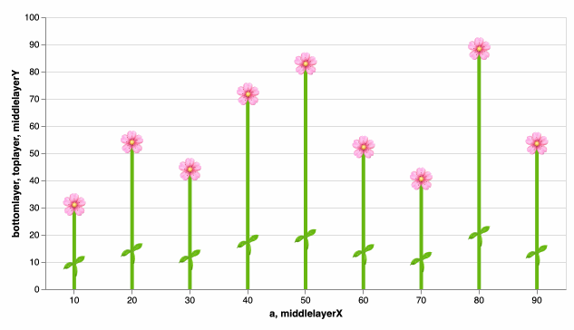

## Happy accidents

While trying to have these butterflies moved more organically, I somehow got this flickering effect. Not really sure what was causing it, but I was happy with the effect and decided to keep it. [View code](https://vega.github.io/editor/#/url/vega-lite/N4IgJAzgxgFgpgWwIYgFwhgF0wBwqgegIDc4BzJAOjIEtMYBXAI0poHsDp5kTykBaADZ04JAKyUAVhDYA7EABoQAEzjQATjRyZ289AEEABBBoIcguIaZJ1h2DcyGA7nRiHETOMtXLDypJhUiiAuyvRoIFBygTSycOrBODZICBBoANqgsilwEQgAnlEMspjxwcRIggy56E42sgAUCDSCwhBwUbLKEA2ybE4NAJTDIAC+Clk5EToIuUpyGaBwpCVpqKCY+Tg1IDNlSvTqbNgWaACMAAwX4yAMOP6l06Zwvf1Dg2MAuqOfSg8o6xAFSqakWIABIEuwSYaAATAAOcagCGwi7QtBiMRI8ERADMaKUMNQABZcdiIcSCSAiQBOM7kiJiKlE+H0iY49AANmZGLJ7IhAHYeagzjSGeh4cL4QLxSAacKxLCfjdMOokLIIAAzNjqBBgqCVKAMQQBHYPBgIShMQwAakMDQaUR65st1oAVPa9gRLlcLpRBoYPX6zoG1V02AgGpdhoYCIZYTGPVClEg1iAEGxSAANMbsg2CI0mx7oJm2+2OtjOgIWq2Bz3Pb2+v0BoOUM4BuMJluGJnBVN5TNwACaudA+cLpoiAHJAHwbgGjdqd9tOINiSGhnL5KE35MqoTLpmwAazQGy2O1KAA9MMETAAvGpLC84BLoWFiMY3OCyKLKWJkE8gBeAGajQcCCMoA7ZsEmzbBEfTNNkgh9heNBrLIxqCDc+TAaB4GQcO0FnhEACODDqjogQ6KQN75g+KgRkgsQZBcCg+t8KpwFeOFgRB6ArmuG4HER6DwbElQfsqQA).

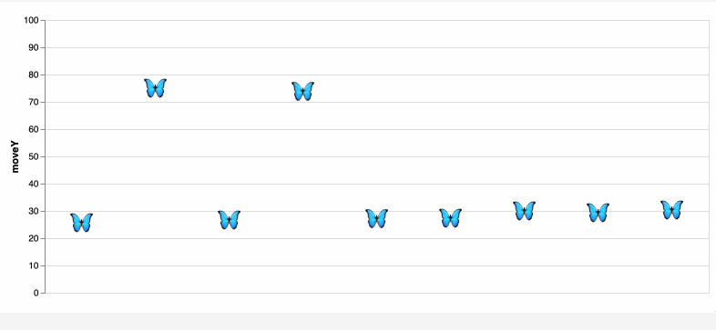

## Graphs using Datadog data

Some other visualisations I made using real Datadog data.

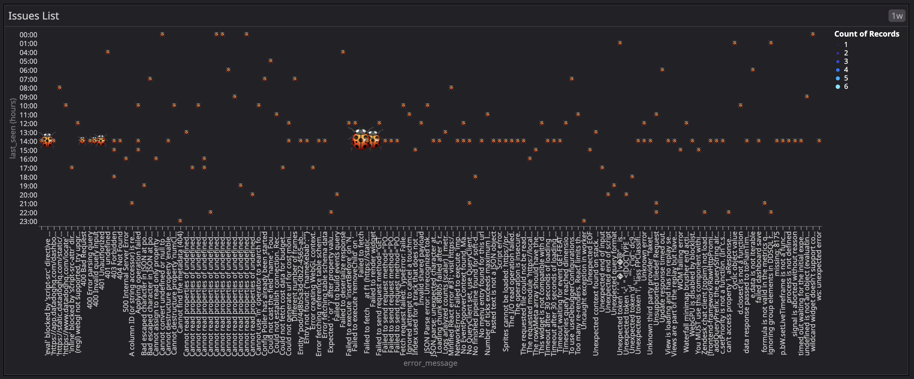

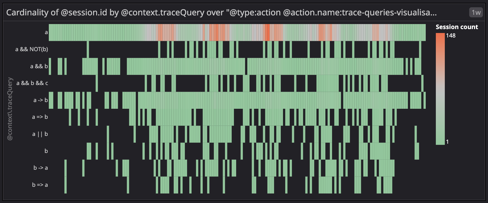

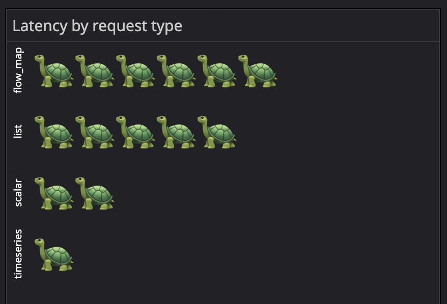

## Cross-graph animation

To create cross-graph animations, I initially tried to get the graphs within a dashboard to talk to each other, which is possible but requires more work. So after a few failed attemptss, I switched to creating the one animation. The same animation is then split into different segments to be displayed on different graphs.

In this example, the first graph shows the first segment of the x-axis, the middle graph shows the second segment and so on. This creates the illusion that the object moves from one graph to another. The effect requires the graphs to be loaded at the same time when loading the page, which fortunately was the case for me when I made the recording.

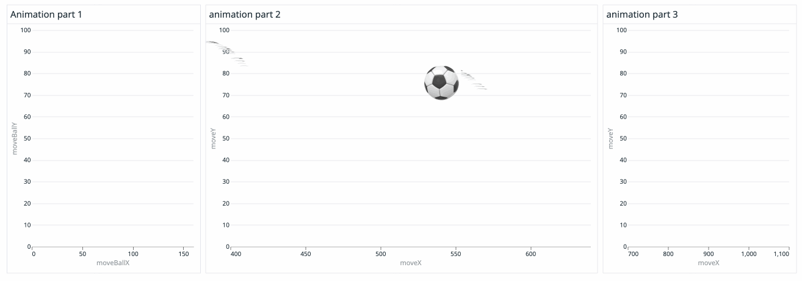

Putting it all together! 💗

