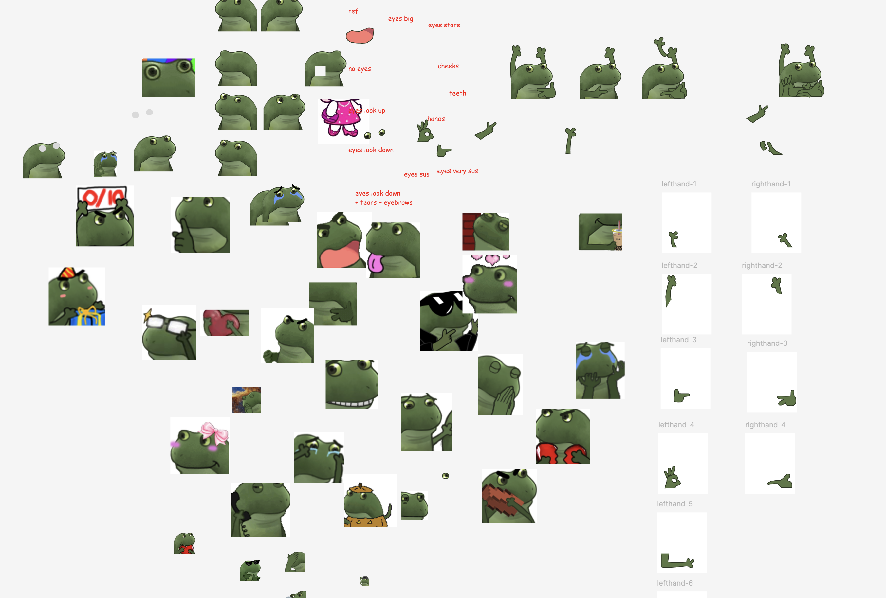
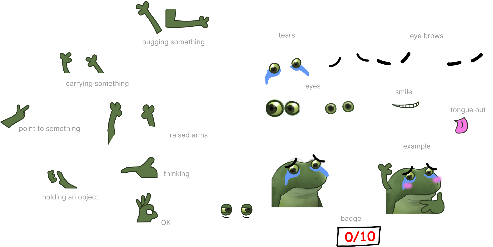

::link{url="https://bufo-generator.pages.dev/"}

A fun little website I built for generating custom Bufo slack emojis. I manually created the assets and vibecoded this using Cursor in a couple of days.

### About Bufo / Froge 
"Bufo also known as Froge or Concerned Frog refers to a set of Discord emotes of a worried or concerned frog expressing various emotions, similar to Pepe emotes. The frog image comes from the now-inactive mobile game Froge, released in 2014 by Fandom Inc. and became popularized as a set of Discord emotes starting in 2020. In 2023, a Froge ChatGPT plugin launched ([source](https://knowyourmeme.com/memes/froge-worry-frog))."

::x{url="https://x.com/metasidd/status/1773359430299529295"}

## Process

I started by downloading and scanning through [hundreds of Bufo emojis](https://github.com/knobiknows/all-the-bufo/blob/main/index.md) to find common patterns and create the assets. After that, I put together a simply UI to use as part of the prompt in Cursor.

## Reaction

The team _loved_ it. Chat exploded with reactions like:
- “This is the best thing EVER”
- “Incredibly useful!!!”
- “Omg I can finally be seen”
-  “Why is Trang always giving us the content we never knew we wanted but absolutely need?”

The team immediately started engaging and building on the idea. The Emoji generator turned out to be more than a fun experiment. It showed how thoughtful details, humor and personality in our tools can create a sense of community and evoke positive emotions. People remember how the tool makes them feel, not just what it does. While this started as a one-off experiment, it got me thinking about how we can build more expressive, human-centered moments into our internal and external products.

Try it live 

::link{url="https://bufo-generator.pages.dev/"}