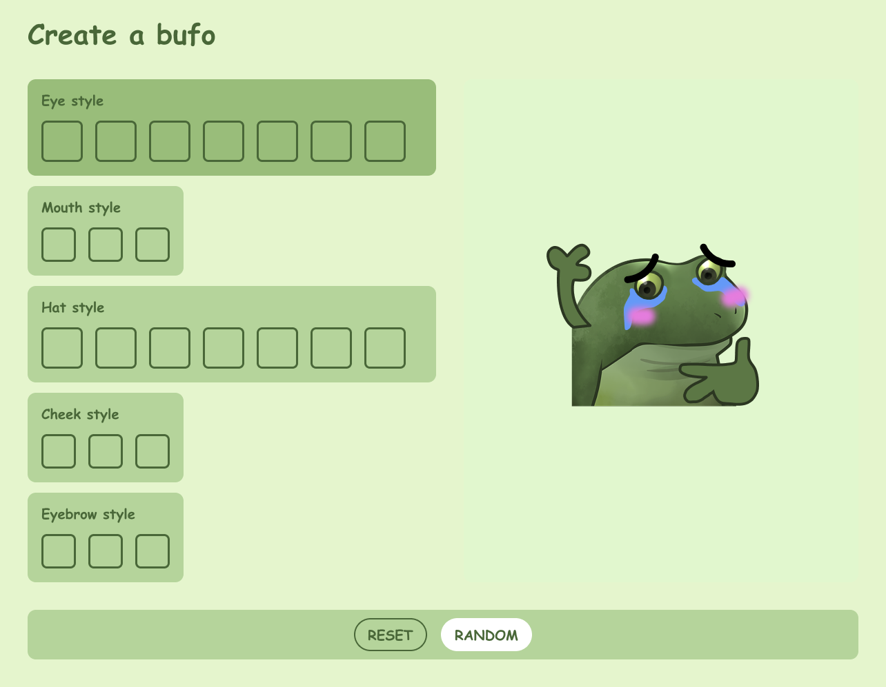

## Concept

A fun little website I built for fun little website for generating Bufo slack emojis. The goal was to create a fast, simple, and fun way for users to turn static images into loopable GIFs with built-in animation styles. Vibecoded using Cursor, the tool includes a range of fun customization options:

🎨 Eyes, mouth, cheeks, hats

💪 Independent arm positions

🔀 Randomize mode

🎉 Celebration confetti

In a world of remote work and emoji-driven communication, non-verbal tone matters. I’ve found that custom emojis aren’t just decorative — they help express intent, build culture, and foster camaraderie. The Bufo emoji series became a hit within my team, and this tool was my way of amplifying that energy — while exploring creative coding in Cursor.
## About Bufo / Froge 
"Bufo also known as Froge or Concerned Frog refers to a set of Discord emotes of a worried or concerned frog expressing various emotions, similar to Pepe emotes. The frog image comes from the now-inactive mobile game Froge, released in 2014 by Fandom Inc. and became popularized as a set of Discord emotes starting in 2020. In 2023, a Froge ChatGPT plugin launched ([source](https://knowyourmeme.com/memes/froge-worry-frog))."

::x{url="https://x.com/metasidd/status/1773359430299529295"}

## Process

Text [link](https://github.com/knobiknows/all-the-bufo/blob/main/index.md)

## Final Results

Text

## Reaction

Try it live 

::link{url="https://bufo-generator.pages.dev/"}