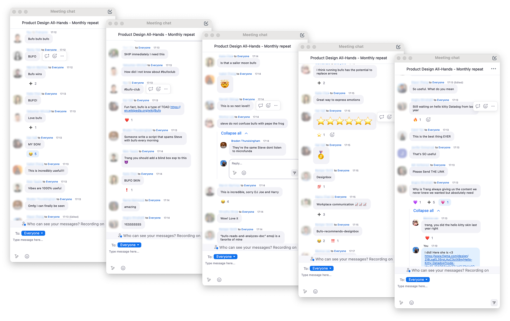

A fun little website I built for generating custom Bufo slack emojis. I manually created the assets and vibecoded this in Cursor over a couple of days.

::link{url="https://bufo-generator.pages.dev/"}

### About Bufo / Froge 
"Bufo also known as Froge or Concerned Frog refers to a set of Discord emotes of a worried or concerned frog expressing various emotions, similar to Pepe emotes. The frog image comes from the now-inactive mobile game Froge, released in 2014 by Fandom Inc. and became popularized as a set of Discord emotes starting in 2020. In 2023, a Froge ChatGPT plugin launched ([source](https://knowyourmeme.com/memes/froge-worry-frog))."

::x{url="https://x.com/metasidd/status/1773359430299529295"}

## Process

I started by downloading and scanning through [hundreds of Bufo emojis](https://github.com/knobiknows/all-the-bufo/blob/main/index.md) to find common patterns and create the assets. After that, I put together a simply UI to use as part of the prompt in Cursor.

## Reaction

The team _loved_ it. Chat exploded with reactions like:
- “This is the best thing EVER”
- “Incredibly useful!!!”
- “Omg I can finally be seen”
-  “Why is Trang always giving us the content we never knew we wanted but absolutely need?”

People immediately started engaging with the idea, sharing jokes, building on it, and even referencing my previous hackathon projects.  What started as a small, goofy experiment turned into something that genuinely resonated. It was a reminder that thoughtful details, humor, and personality in tools can spark joy and build community. People don’t just remember what a tool does, they remember how it made them *feel*. 

Try it live 

::link{url="https://bufo-generator.pages.dev/"}