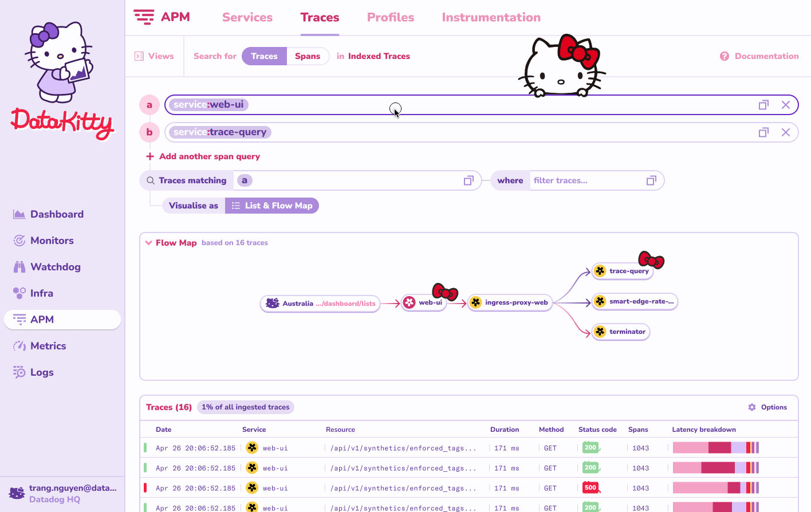
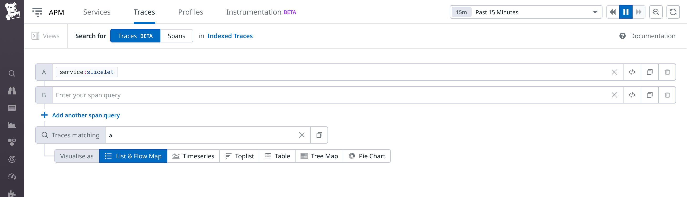
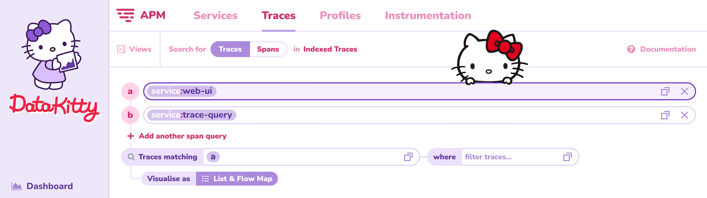
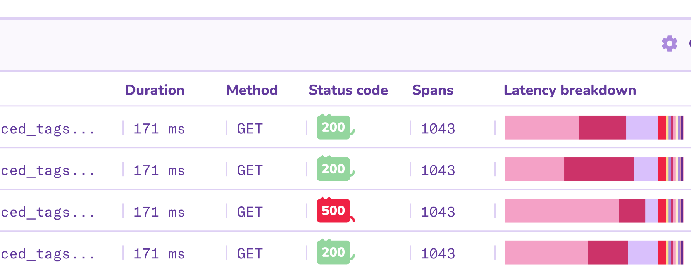
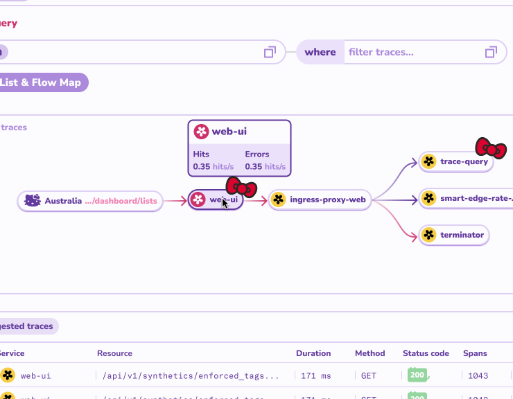
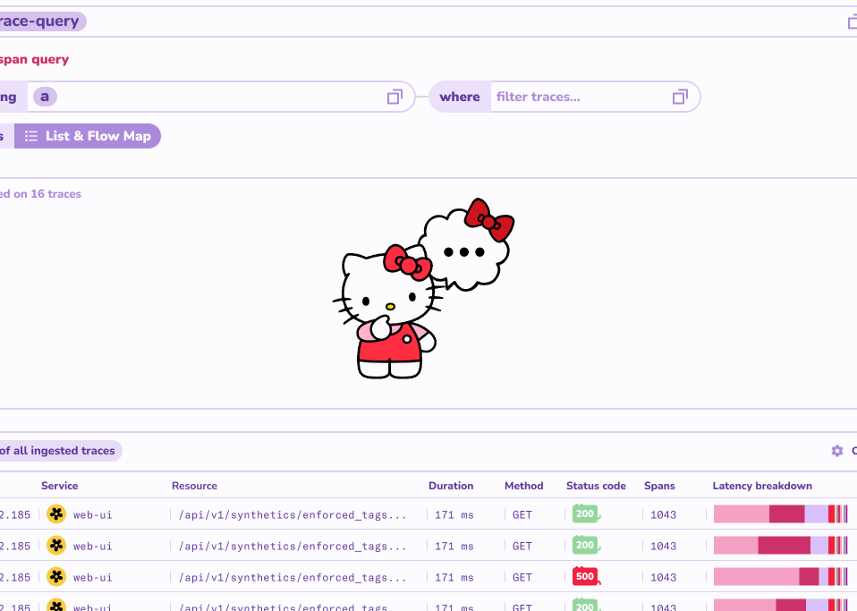
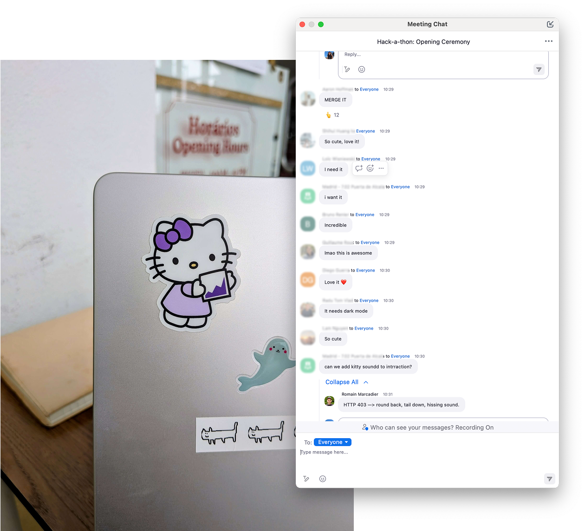

## Concept

As part of an internal company hackathon, I reimagined the Datadog branding through a playful lens. The Hello Kitty theme featured soft color palettes, rounded corners, sprinkled with lighthearted animations, offering a stark and refreshing contrast to the typical look and feel from observability tools.

## The response

The response was overwhelming: everyone smiled when they saw it. Many said it actually made them want to spend more time in Datadog, with some even suggesting that this theme could boost morale and productivity if it was implemented. One coworker printed the assets as stickers, which quickly spread across laptops in the office :-).

