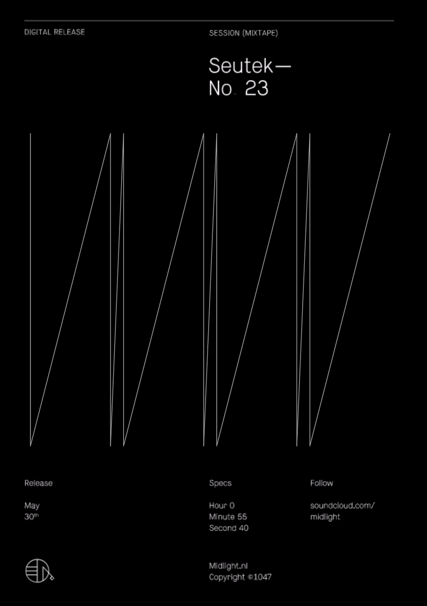
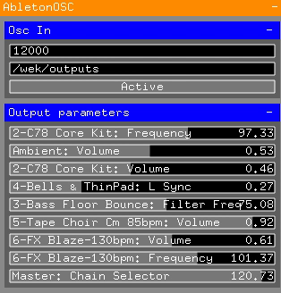
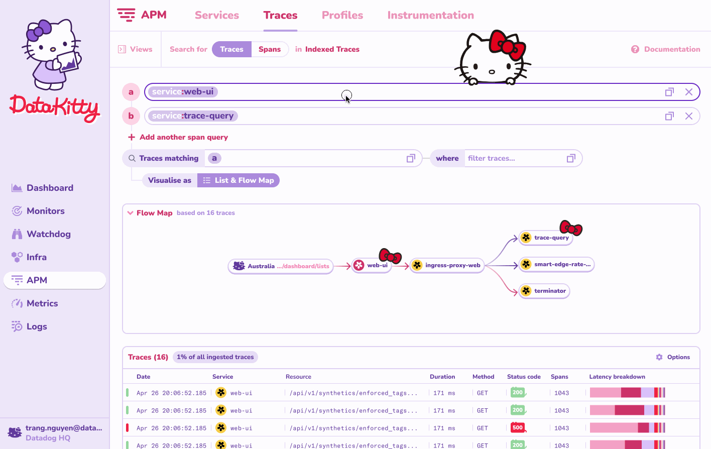

Outside of design, I enjoy using code as a medium for creative expression and experimentation. In my work, I often take a playful, sometimes naive approach to digital tools, mixing inputs and outputs in unconventional ways. Below are some of my favorite projects since 2018.

---

##### Study with Me, 2018
I made this app for my sister to help her stay focused during exam season. Inspired by the [‘Study With Me’ video series](https://www.youtube.com/watch?v=1ex_bNIFR1A) on YouTube, the application plays a 1-hour video of someone quietly studying. It can detect when my sisters look away, and will nag her whenever she gets distracted.

**Tools**</br>
Wekinator, Processing, OpenCV

Audio transcripts (Vietnamese to English):
- Mích, học bài đi _Mích, back to study_
- Mích đừng mất tập trung nữa _Mích, stop losing focus_
- Học đi cho mẹ vui _Mích, study and make your mom happy_
- Mích đang nghĩ gì đấy? _Mích, what are you doing?_
- Đã bảo rồi đừng có mất tập trung nữa _I told you so, focus!_

::link{url="https://youtu.be/L3PLmjyZy0E"}
 
---

##### People with My Name, 2018
I google-searched my full name and scraped the first 500 image results. From those, I cropped out faces and used [t-SNE](https://lvdmaaten.github.io/tsne/) for dimensionality reduction to cluster similar images. It’s worth noting that Trang Nguyen is a fairly common Vietnamese name. Made possible using [Aarón Montoya-Moraga](https://github.com/montoyamoraga)’s Google Images scraping tool
 and [Andreas Refgaard](https://www.andreasrefsgaard.dk/)’s face-cropping Processing tool.

**Tools**</br>
Processing, t-SNE


---

##### Git Song, 2018
I turned my [GitHub contribution graph](https://github.com/topics/contribution-graph) into music. As time moves forward, notes play to represent daily contributions; the more contributions, the higher and louder the note. The data is mapped across 3 octaves, starting from octave 4.

**Tools**</br>
[Sonic Pi](https://sonic-pi.net/)

::link{url="https://youtu.be/R-gS9AFVL1o"}

---

##### Audio Reactive Visuals, 2018
A series of audio reactive posters I created for [Midlight](https://soundcloud.com/midlight/) using Processing. Original static visuals designed by [Studio Naam](https://studionaam.com/).

**Tools**</br>
Processing




---

##### Spark AR filters, 2018
A filter I developed in Spark AR as part of the Meta's Spark AR Hackathon Berlin in 2018.


**Tools**<br>
Spark AR


---

##### P5.js Posenet as MIDI Controller, 2020 
Control Ableton Live with your hands. Made with PoseNet, a ML model that allows for real-time human pose estimation by finding different points on your body and face. [See demo video](https://vimeo.com/331012711?fl=pl&fe=sh).

**Tool**<br>
Ableton, poseNet, p5.js



---

##### Ceramics, 2021-2024

Shifted my focus from working with the computer to working with my hands between 2021 and 2024. My favourite project has been building these little chair sculptures.


---


##### Datadog Hello Kitty Theme, 2024
Wanting a refreshing departure from Datadog's traditional utilitarian look and feel, I gave the UI a makeover. This Hello Kitty theme introduced a soft pastel color palette, rounded corners and playful animations everywhere! 

**Tools**</br>
Figma




---

**Bufo Emoji Generator, 2025** <br>

A fun little website I built for generating custom [Bufo](https://knowyourmeme.com/memes/froge-worry-frog) slack emojis. I manually created the assets and vibecoded this in Cursor over a couple of days. [Check it out](https://bufo-generator.pages.dev/).

**Tools**</br>
Figma, Cursor

::link{url="https://bufo-generator.pages.dev/"}

---


##### Animating scatterplots with Vega-Lite, 2025
Data visualisations created when Datadog rolled out the support for [Vega-Lite](https://en.wikipedia.org/wiki/Vega_and_Vega-Lite_visualisation_grammars).  An open-source visualization grammar that allows allows users to create graphs that are not available within the native Datadog widget and query system. 

**Tools**<br>
Vega-Lite

The first animation I created was this [scatterplot of falling raindrops](https://vega.github.io/editor/#/url/vega-lite/N4IgJAzgxgFgpgWwIYgFwhgF0wBwqgegIDc4BzJAOjIEtMYBXAI0poHsDp5kTykBaADZ04JAKyUAVhDYA7EABoQOJACckCCGgDaoWRrhoQmGgkNK5O0HFKzMW1KEwBPHIfQmzqxcZiq22ILuAIwADAC+Sgw4ACZImO7GpnAAFLJsAO4pAJTZIOEAuoVKcZgojiDESIIMcA66IAAeRsEATJQAzKEA7N0+zkZdlKFiACzB+QqgzeitwcOtYgBs-UajAJyUS0vrYpPTRnMLy6uzS5StPev7TYOhlN07racgreeX3deRB+gdHZRiAAc6z6SgGZwB60WNxmIA65yhHQmYLW91GHUBfW+t3QowRrSRLwxAOCJ2xsLEoRewU2212MMO53GoQ6L0BlGChPJqJJrUB1PZYlJK256CW7UBlz2KNxEklfwZYrlING1IkI3GipAgNGHNCbxerVpOz2ou1-yBIKJ8zEUNNUxxIG6-x14utlBB3WeZpBHM+0pA4JAo26nSWwX5Zu6EjakpeS3ZnImZo2D3RKxlIDEcoJrLNHV1HVt8eN9LNby221BgaMS1D3Txqp9lFGmOemaWur5Gy1urCBszIbDEa1-x6OyJHK5DthwJbbZeurp9p+IDCY8e10zRsrZZnRnW522dfjOYVUfZeNJL2WFyuWsPLfXL19Dc7Wu69037Zr6E+u5XR1O06YtM0fD4vn3dBKTZeZPW9KCsyZZ9M26ODegQ1dRnuIU+TZM880Q0YJSlalQnueVCNXI4+TmNlBWFLU2gBTtkV-NdyOGMZk0QiRWLZC1GMKSJjHUWQIAAMzYVQECsEAoGqKAGEEeJEgAckAXg3AHKdtSfCQBwQEQNhJBoG4FMEJSVISFpyIAAgAalslJSgYBBKGcWz+FszxRDCUJslsgBSWy-Ic2yIBoWRnPiVz3NsgAqbzkgIPzyLyJR9KMBA2FIABNfICiUOBZCgNgYkisg0FAcFQAkmg4EEGIspyuB8qUFw3CMABHBgkDsOh4hoUgfGgap3FAGI2GQSKdFCBQ-KKESZlq+rGqMZp2tcRIer6kwyhMYaRIigAvcbKmqWo0EuESEkaTAqpAOqGqa9AjJMnwOsSdIEEi6p8hE5BVAAayMW77vCIA), using a simple dataset with about 40 points.Each point is represented with a 💧 emoji using Vega-Lite’s [text mark](https://vega.github.io/vega/docs/marks/text/).


To make the raindrops "fall", I added a timer. It updates every 10ms and is the time that passed since  the visualization loaded. 

```jsx
{
  "name": "time", 
     "on": [{"events": {"type": "timer", "throttle": 10}, "update": "now()"}] 
}
```

Using this timer, I updated the Y position of each raindrop with a combination of modulo (%) and sine to create looping vertical movement with some variation in speed:

```jsx
"transform": [
    {
      "calculate": "100 + (datum.y - time/100) % 100 + sin(datum.y * time/10000)",
      "as": "moveY"
    }
  ]
```
And voilà, animated rain. [View code.](https://vega.github.io/editor/#/url/vega-lite/N4IgJAzgxgFgpgWwIYgFwhgF0wBwqgegIDc4BzJAOjIEtMYBXAI0poHsDp5kTykBaADZ04JAKyUAVhDYA7EABoQOJACckCCGgDaoWRrhoQmGgkNK5O0HFKzMW1KEwBPHIfQmzqxcZiq22ILuAIwADAC+Sgw4ACZImO7GpnAAFLJsAO4pAJTZIOEAuoVKcZgojiDESIIMcA66IAAeRsEATJQAzKEA7N0+zkZdlKFiACzB+QqgzeitwcOtYgBs-UajAJyUS0vrYpPTRnMLy6uzS5StPev7TYOhlN07racgreeX3deRB+gdHZRiAAc6z6SgGZwB60WNxmIA65yhHQmYLW91GHUBfW+t3QowRrSRLwxAOCJ2xsLEoRewU2212MMO53GoQ6L0BlGChPJqJJrUB1PZYlJK256CW7UBlz2KNxEklfwZYrlING1IkI3GipAgNGHNCbxerVpOz2ou1-yBIKJ8zEUNNUxxIG6-x14utlBB3WeZpBHM+0pA4JAo26nSWwX5Zu6EjakpeS3ZnImZo2D3RKxlIDEcoJrLNHV1HVt8eN9LNby221BgaMS1D3Txqp9lFGmOemaWur5Gy1urCBszIbDEa1-x6OyJHK5DthwJbbZeurp9p+IDCY8e10zRsrZZnRnW522dfjOYVUfZeNJL2WFyuWsPLfXL19Dc7Wu69037Zr6E+u5XR1O06YtM0fD4vn3dBKTZeZPW9KCsyZZ9M26ODegQ1dRnuIU+TZM880Q0YJSlalQnueVCNXI4+TmNlBWFLU2gBTtkV-NdyOGMZk0QiRWLZC1GMKSJjHUWQIAAMzYVQECsEAoGqKAGEEeJEgAckAXg3AHKdtSfCQBwQEQNhJBoG4FMEJSVISFpyIAAgAalslJSgYBBKGcWz+FszxRDCUJslsgBSWy-Ic2yIBoWRnPiVz3NsgAqbzkgIPzyLyJR9KMBA2FIABNfICiUOBZCgNgYkisg0FAcFQAkmg4EEGIspyuB8qUFw3CMABHBgkDsOh4hoUgfGgap3FAGI2GQSKdFCBQ-KKESZlq+rGqMZp2tcRIer6kwyhMYaRIigAvcbKmqWo0EuESEkaTAqpAOqGqa9AjJMnwOsSdIEEi6p8hE5BVAAayMW77vCIA)


After that, I created other animations using similar principles with different functions, using [Graphtoy](https://graphtoy.com/?f1(x,t)=4%20+%204*smoothstep(0,0.7,sin(x+t))&v1=false&f2(x,t)=clamp((atan(((x/10.)%25100)/8-1)*60),%200,%20100)&v2=true&f3(x,t)=sqrt((x/10.)%25100)%20*%208&v3=true&f4(x,t)=((x%20-%20200)/10.)%25100&v4=true&f5(x,t)=(t%20+%20floor(x-t))/2%20-%205&v5=false&f6(x,t)=sin(f5(x,t))%20-%205&v6=false&grid=1&coords=521.7855192792142,66.89164551771165,597.4221734999295) to test and visualise the motion path. 


I also experimented with creating cross-graph animations, moving an object from one graph to another. I did this by having each graph renders a different segment of the animation’s X-axis. When loaded together, they appear as one continuous animation spread across panels. The effect only works if all graphs load simultaneously.


