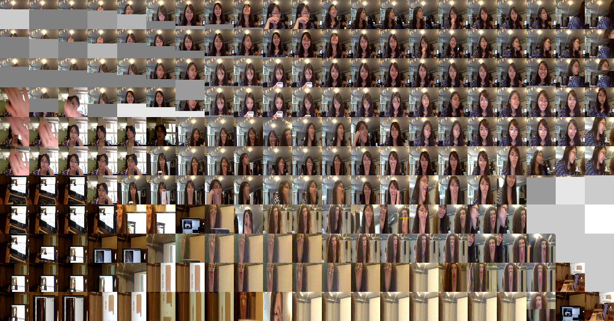

In August 2018, I took part in an intensive 4-week full-time course on creative applications of Machine Learning at [School of Machines](https://www.schoolofma.org/) in Berlin. The course was led by [Gene Kogan](https://genekogan.com/) and [Andreas Refsgaard](https://www.andreasrefsgaard.dk/), and was designed to encourage experimentation, interaction, and have fun with algorithms and machine learning.

During the course, we explored:
- Use [Wekinator](http://www.wekinator.org/) to build small interactive applications and connecting it to other creative coding tools and sensors.
- Train our own models, running open-source models as well as using out-of-the-box tools like [Runway ML](https://runwayml.com/). 

Many of the experiments from that course, and the year that followed, were documented here on my previous blog.

::link{url="https://nmtrang29.github.io/"}
 