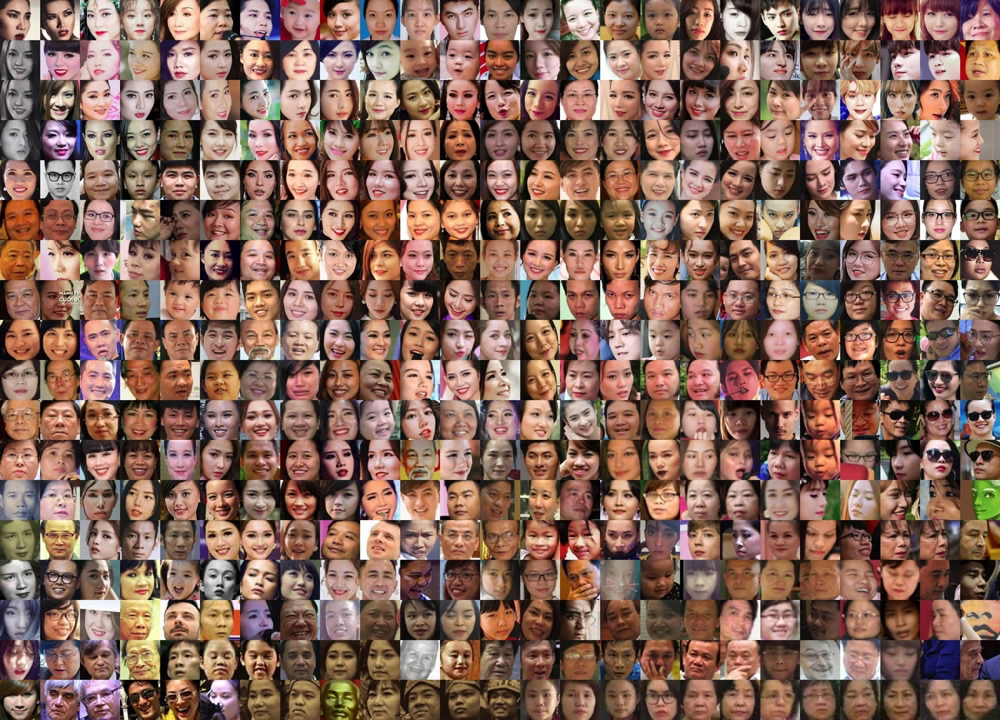

In August 2018, I took part in an intensive 4-week full-time course on creative applications of Machine Learning at [School of Machines](https://www.schoolofma.org/) in Berlin. The course was led by [Gene Kogan](https://genekogan.com/) and [Andreas Refsgaard](https://www.andreasrefsgaard.dk/), and was designed to encourage experimentation, interaction, and to have fun with algorithms and machine learning.

During the course, we learned about:
- Various types of supervised ML (classification, regression and dynamic time wrapping) using [ml5.js](https://ml5js.org/)
- Sending and receiving OSC messages via [Wekinator](http://www.wekinator.org/) using Processing and Openframeworks to create interactive applications
- Generative models. Preparing datasets and training custom models using [Paperspace](https://www.paperspace.com/)

Here are some of the experiment from that course and the year that followed:

::link{url="https://github.com/nmtrang29/machine-learning-schoolofma"}

---

## Study with Me
I made this app for my sister to help her stay focused during exam season. Inspired by the [‘Study With Me’ video series](https://www.youtube.com/watch?v=1ex_bNIFR1A) on YouTube, the application plays a 1-hour video of someone quietly studying. It can detect when my sisters look away, and will nag her whenever she gets distracted.

Audio transcripts (Vietnamese to English):
- Mích, học bài đi _Mích, back to study_
- Mích đừng mất tập trung nữa _Mích, stop losing focus_
- Học đi cho mẹ vui _Mích, study and make your mom happy_
- Mích đang nghĩ gì đấy? _Mích, what are you doing?_
- Học đi nhìn cái gì _What are you looking at?
- Đã bảo rồi đừng có mất tập trung nữa _I told you so, focus_

::link{url="https://youtu.be/L3PLmjyZy0E"}
 
## People with My Name
I google-searched my own name and scraped the first 500 image results. From those, I cropped out faces and used [t-SNE](https://lvdmaaten.github.io/tsne/) for dimensionality reduction to cluster similar images. It’s worth noting that Trang Nguyen is a fairly common Vietnamese name. 

This project was made possible using [Aarón Montoya-Moraga](https://github.com/montoyamoraga)’s Google Images scraping tool
 and [Andreas Refgaard](https://www.andreasrefsgaard.dk/)’s face-cropping sketch in Processing.

## Git Song
I turned my [GitHub contribution graph](https://github.com/topics/contribution-graph) into music. As time moves forward, notes play to represent daily contributions; the more contributions, the higher and louder the note. The data is mapped across 3 octaves, starting from octave 4, and the sound is generated with [Sonic Pi](https://sonic-pi.net/).

::link{url="https://youtu.be/R-gS9AFVL1o"}