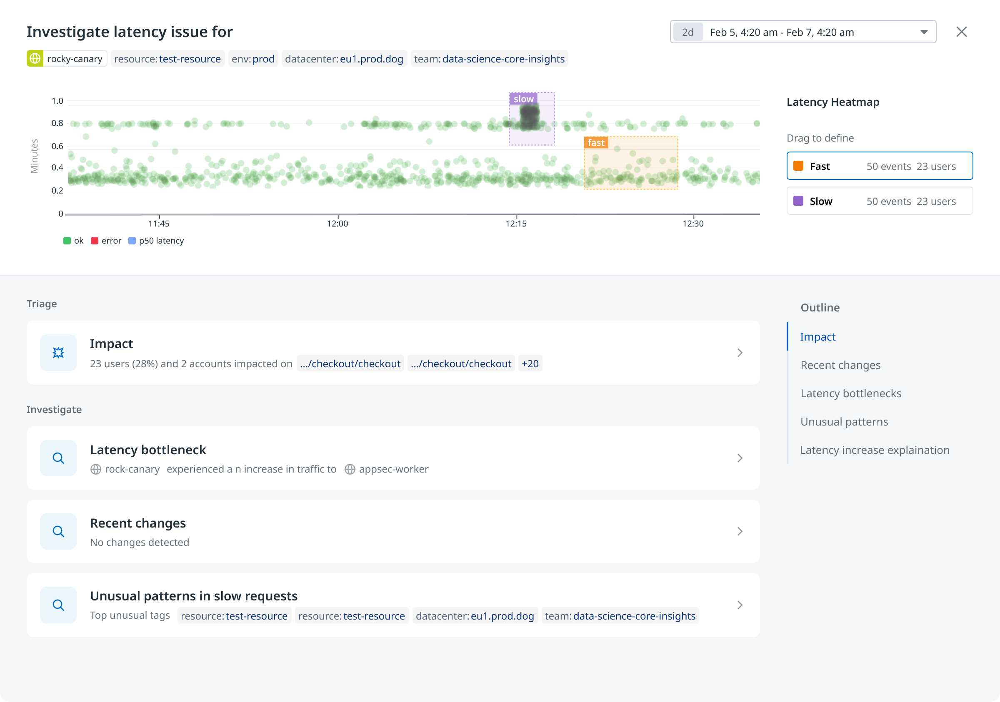
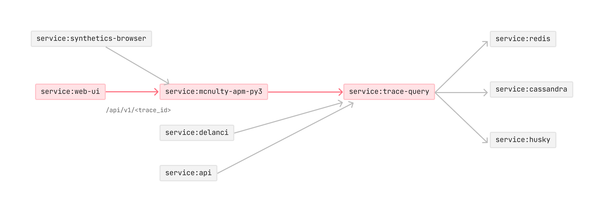
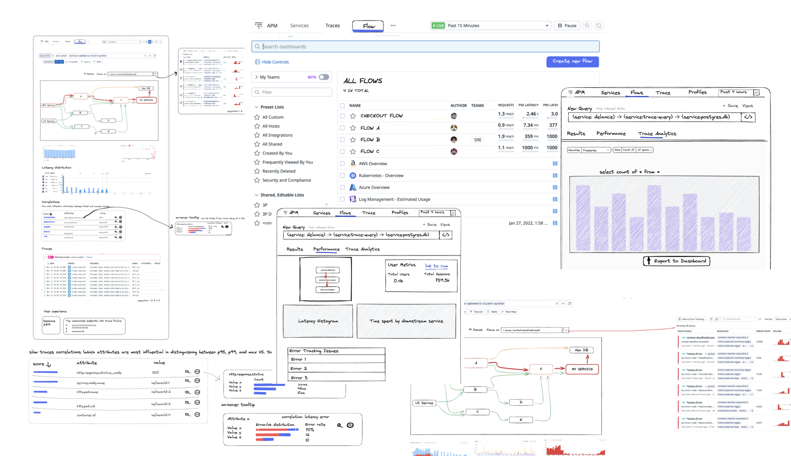
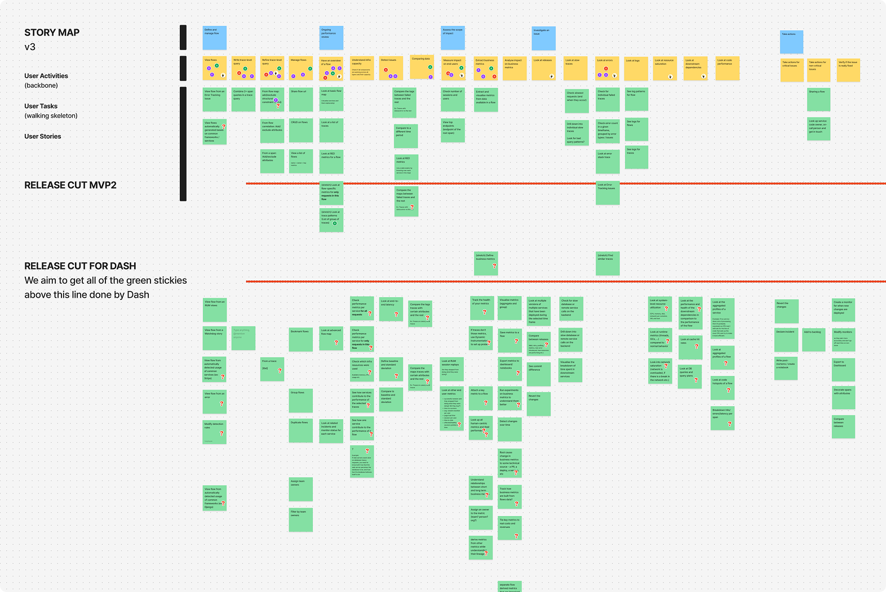
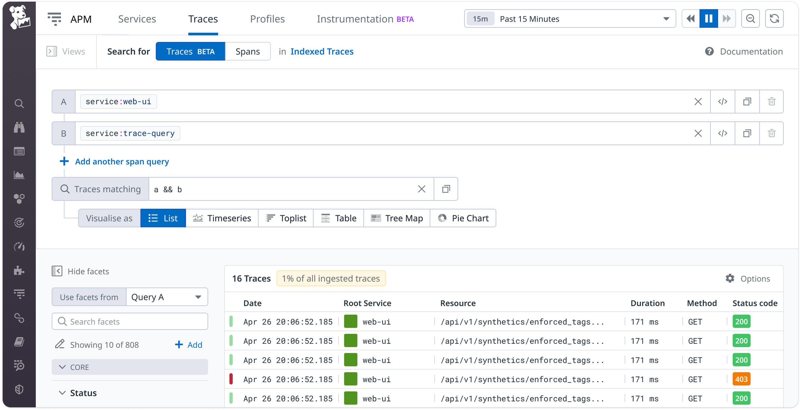
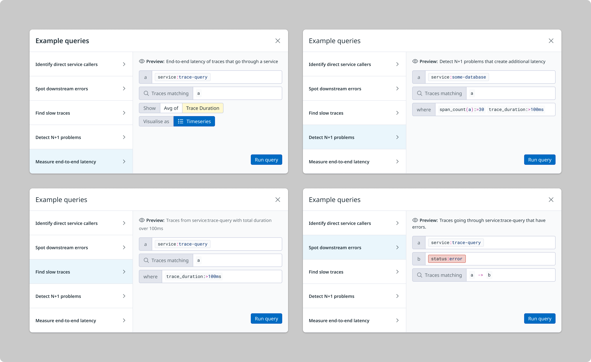
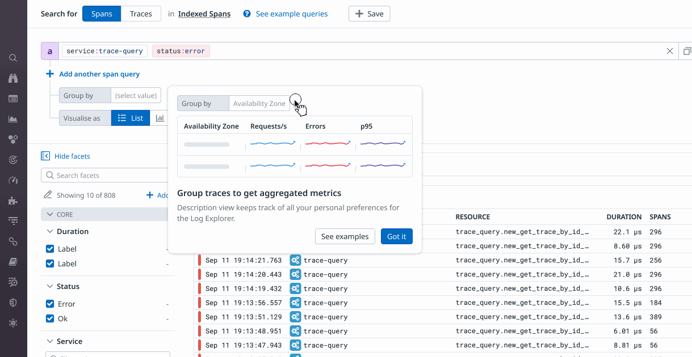

Application Performance Monitoring (APM) is a core product offering from Datadog, generating over $500M ARR for the company. Since joining the team in 2022, I have been leading the design of some of APM’s most valuable initiatives. 

My live design work was showcased at [Dash by Datadog conference](https://www.dashcon.io/) 3 years in a role, including [Trace Queries (2023-2024)](https://www.youtube.com/live/GjcLWupY0jk?t=3574s), [Change Tracking (2024)](https://www.youtube.com/live/ZMNXNH-kJAM?feature=shared&t=4840), [Recommendations (2025)](https://www.youtube.com/live/FW8_RoDxnpc?feature=shared&t=2092), and [Latency Investigator (2025)](https://www.youtube.com/live/FW8_RoDxnpc?feature=shared&t=1948). Since the public launch in 2024, the team and I have grown [Trace Queries](url="https://www.datadoghq.com/blog/trace-queries/) from <mark>0 to over 45,000 monthly active users</mark>.

Across the team, I'm known for consistently taking complex and ambiguous product ideas to key workflows that ship. These are all projects that require deep technical knowledge, cross-team coordination, and challenging stakeholder management. 

## Latency Investigation (2025, Private Beta) 

In December 2024, I proposed a product initiative to address a common customer pain point: difficulty in discovering and using the right tools within Datadog to troubleshoot latency issues. The idea was later adopted as a formal OKR and became one of APM’s flagship projects for the year. It was [showcased](https://www.youtube.com/live/FW8_RoDxnpc?t=1948s) at the company's conference  and continues to be developed by a dedicated squad as of Q4 2025.

##### Scope & Impact
- Led the design strategy and execution from initial concept to private beta launch
- Successfully demoed publicly, ranking 3rd out of 42 new features in customer interest
- Over 2,000 investigations were initiated in the past month, a strong signal of adoption, especially given the feature is in private beta and limited to just 232 organizations

##### Timeline
- 6 months from concept to private beta 

**🎥 Live Demo**

::link{url="https://www.youtube.com/live/FW8_RoDxnpc?feature=shared&t=1948"}

---

## Proactive Recommendations (2025, Private Beta)

In 2025, I led the design and research of  Recommendations, introducing a proactive and personalized user flow, a major shift from the previous reactive model.

##### Scope & Impact
- Led design from early concept to private beta launch
- Successfully demoed publicly, ranking 8th out of 42 new features in customer interest
- The framework designed was later adopted by other product teams, accelerating the development of their recommendations. Contributed to the Datadog’s guidelines for insights and recommendations.
- Led workshops across teams (Database Monitoring, Profiling, Change Tracking) to ensure a consistent UX and design language across the platform.

**🎥 Live Demo**

::link{url="https://www.youtube.com/live/FW8_RoDxnpc?feature=shared&t=2092"}

---

## Trace Queries (2023-2024, GA)

Between 2023 and 2024,I led the design of [Trace Queries](https://www.datadoghq.com/blog/trace-queries/), a product that expanded the analytical power of distributed tracing in Datadog. It unlocked entirely new capabilities, enabling users to query traces based on service relationships, end-to-end latency thresholds, and other complex conditions that were previously impossible to express.

##### Impact
- Launched a major addition to APM
- Growing the product from <mark>0 to over 45,000 monthly active users</mark> within one year after GA

##### Scope & Team 
- Led the entire design process, including strategy, user research, design execution, and post-launch evaluation. 
- Collaborated closely with a cross-functional team of 30+ including PMs, TPMs, Senior/Staff+ Engineers, and Engineering Managers.
- The work underwent multiple rounds of review with VPs of Engineering, Product, and Design prior to launch

##### Timeline
- 1 year from concept to public launch 

<!-- ::link{url="https://www.datadoghq.com/blog/trace-queries/"} -->

---

##### Why add Trace Queries?
Distributed traces hold a wealth of information, but finding the right ones as part of the troubleshooting process can feel like searching for a needle in a haystack. For example, in January 2023, Datadog customers reported that the UI failed to load traces, pointing to issues somewhere along the request path:

To debug the issue, you'd need to express a query like "Find traces that passed through both `web-ui` and `trace-query`, where `trace-query` returned an error."

At the time, Datadog’s query language couldn’t express this structure. The UI only allows you to users to write `service:trace-query status:error`, which returned many irrelevant results. While the data existed, there was no way to query based on span relationships:

Users faced similar challenges when trying to answer questions like:
- Which errors in trace-query service result in an upstream errors?
- Upstream service calls grouped by service
- Downstream service calls with high latency
- Traces where one service calls another more than 10 times

The usual workarounds (inject spans to get more information, resort to logs, keep browsing...) are manual, time-consuming, and often hitting cardinality limits.

##### Process
With the need for a new language that can express more complex questions, I kicked off the project with an intensive exploration phase focused on understanding pain points. Examples of use cases that were collected from customers during this phase:

> Monitor an end-to-end request availability (with multiple points of failure) and not individual services’ availability (Indeed).

> Identify relevant traces when the information is spread across
multiple spans from the same request (Mercedes-Benz).

Armed with insights and a list of clients that were willing to give us feedback along the way, I began translating their needs into concrete concepts, sketching initial user flows and interactions using Excalidraw. This low-fidelity prototyping allowed for rapidly iterating without getting bogged down in details too early.

One key activity during this phase was a user story mapping exercise, which we ran over multiple rounds to align on the scope, priorities, and a shared vision of what we committed to build.

##### Outcome

**🎥 Live Demo**
::link{url="https://www.youtube.com/live/GjcLWupY0jk?t=3574s"}

