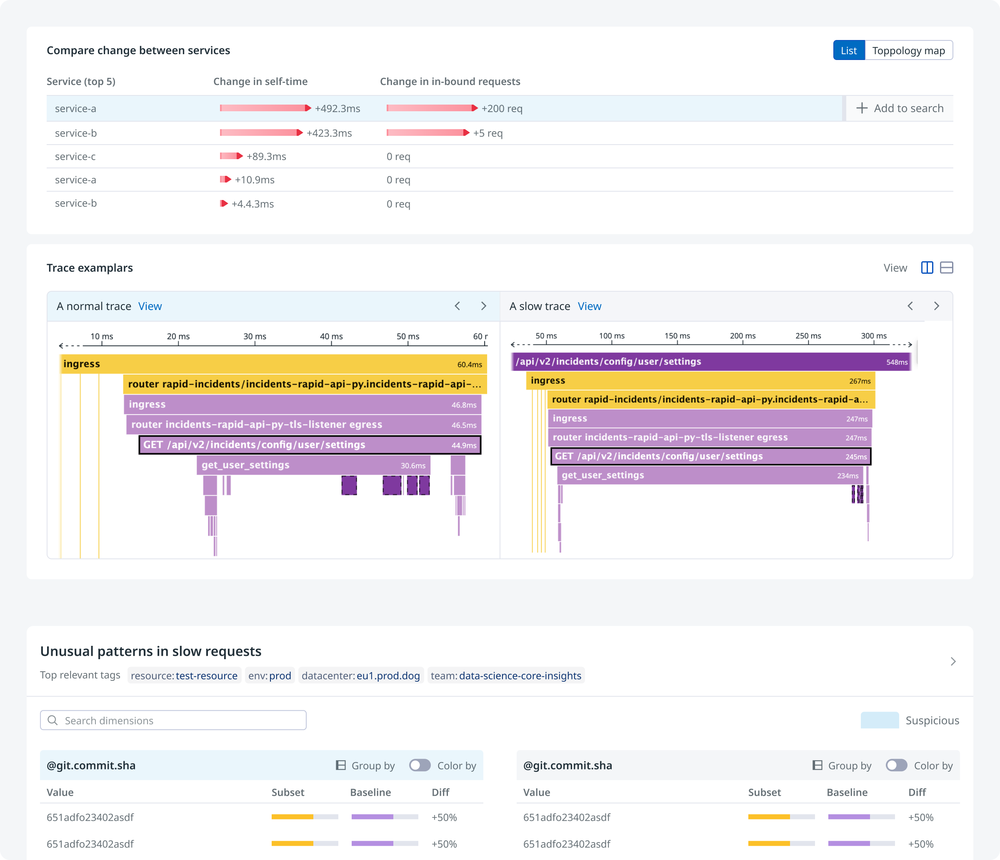
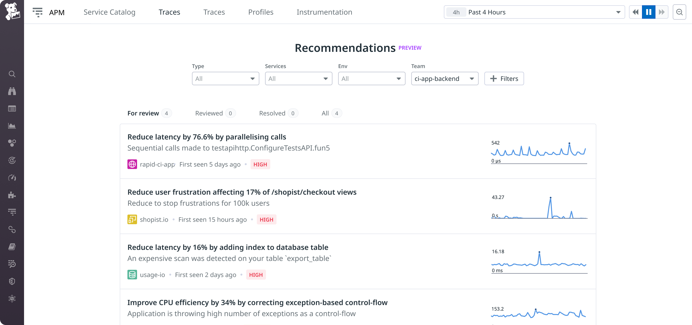
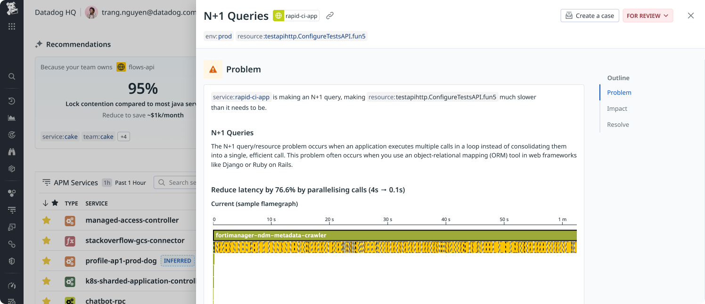
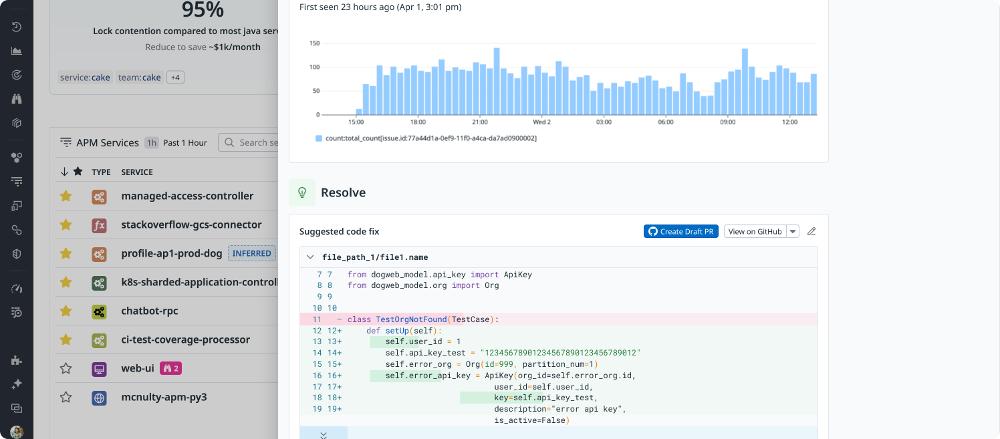

Application Performance Monitoring (APM) is a core product offering from Datadog, generating $500M ARR for the company. Since joining the team in 2022, I have been leading product design of some of APM’s most valuable initiatives, including [Trace Queries (2023-2024)](https://www.youtube.com/live/GjcLWupY0jk?t=3574s), [Change Tracking (2024)](https://www.youtube.com/live/ZMNXNH-kJAM?feature=shared&t=4840), [Recommendations (2025)](https://www.youtube.com/live/FW8_RoDxnpc?feature=shared&t=2092), and most recently, [Latency Investigator (2025)](https://www.youtube.com/live/FW8_RoDxnpc?feature=shared&t=1948). 

Since the launch in 2024, I have grown Trace Queries from <mark>0 to over 45,000 monthly active users (72% of all Datadog APM users)</mark> within one year after GA.

Across the team, I'm known for consistently taking complex and ambiguous product ideas to key workflows that ship in production. These are all projects that require deep technical knowledge, cross-team coordination, and challenging stakeholder management.  

---

## AI Latency Investigation (2025) 

In December 2024, I proposed a product initiative to address a common customer pain point: difficulty in troubleshooting latency issue, despite Datadog having the right tools. I authored the initial concept document, which was later tuned into as a formal OKR and became the APM flagship project for the year. 

After a successful public demo, the project continues to be developed by a dedicated squad as of Q4 2025, focusing on improving the accuracy of the AI agent's output. 

##### Impact
- Became the <mark>#1 requested feature</mark> (out of 42) following the company’s annual announcement
- Over 2,000 investigations were initiated in the past month, a strong signal of adoption, despite being in private beta, limited to 232 organizations
- The initiative was made possible by foundational features I had designed the previous year, including [Tag Analysis](https://www.datadoghq.com/blog/tag-analysis/) and [Trace Groups](https://docs.datadoghq.com/tracing/trace_explorer/query_syntax/#trace-groups).

##### Scope & Team
- Led the entire design process end-to-end of a high-ambiguity, cross-team initiative from concept to private beta
- Collaborated closely with a cross-functional team of 15 people including PMs, Senior/Staff+ Engineers, Managers and Directors.

##### Milestones
- 6 months from concept to private beta 

**🎥 Live Demo**

::link{url="https://www.youtube.com/live/FW8_RoDxnpc?feature=shared&t=1948"}

---

## Datadog Recommendations (2025)

In 2025, I led the design of Datadog Recommendations, shifting the experience from a reactive model to a more proactive and personalized user flow.

##### Impact 
- <mark>Something about the research</mark>
- I facilitated workshops with teams across Database Monitoring, Profiling, and Change Tracking to drive consistency in UX across the platform.
- The framework I developed was later adopted by other product teams, accelerating their ability to build recommendations and shaping Datadog’s broader guidelines for insights and recommendations.

##### Scope & Team
- Owned the end-to-end design process, from research and strategy to execution. 
- Collaborated closely with a core team of 5, while partnering with multiple product teams to align on recommendation priorities, state management, and data quality.

**🎥 Live Demo**

::link{url="https://www.youtube.com/live/FW8_RoDxnpc?feature=shared&t=2092"}

---

## Trace Queries (2023-2024)

Between 2023 and 2024, I led the design of [Trace Queries](https://www.datadoghq.com/blog/trace-queries/), a product that expanded the analytical power of distributed tracing in Datadog. It unlocked entirely new capabilities, enabling users to query traces based on service relationships, end-to-end latency thresholds, and other complex conditions that were previously impossible to express.

##### Impact
- Launched a major addition to APM, a $500M ARR business for Datadog.
- Growing the product from <mark>0 to over 45,000 monthly active users (72% of all Datadog APM users)</mark> within one year after GA 

##### Scope & Team 
- Led the entire design process end-to-end, including strategy, user research, design execution, and post-launch evaluation. 
- Collaborated closely with a cross-functional team of 30+ including PMs, TPMs, Senior/Staff+ Engineers, and Engineering Managers.
- The work underwent multiple rounds of review with VPs of Engineering, Product, and Design prior to launch

##### Milestones
- 6 months from concept to private beta
- 5 months from private beta to GA 

<!-- ::link{url="https://www.datadoghq.com/blog/trace-queries/"} -->

---

##### Why add Trace Queries?
Distributed traces hold a wealth of information, but finding the right ones as part of the troubleshooting process can feel like searching for a needle in a haystack. For example, in January 2023, Datadog customers reported that the UI failed to load traces, pointing to issues somewhere along the request path:

To debug the issue, you'd need to express a query like "Find traces that passed through both `web-ui` and `trace-query`, where `trace-query` returned an error."

At the time, Datadog’s query language couldn’t express this structure. The UI only allows you to users to write `service:trace-query status:error`, which returned many irrelevant results. While the data existed, there was no way to query based on span relationships:

Users faced similar challenges when trying to answer questions like:
- Which errors in trace-query service result in an upstream errors?
- Upstream service calls grouped by service
- Downstream service calls with high latency
- Traces where one service calls another more than 10 times

The usual workarounds (inject spans to get more information, resort to logs, keep browsing...) are manual, time-consuming, and often hitting cardinality limits.

##### Process
With the need for a new language that can express more complex questions, I kicked off the project with an intensive exploration phase focused on understanding pain points. Examples of use cases that were collected from customers during this phase:

> Monitor an end-to-end request availability (with multiple points of failure) and not individual services’ availability (Indeed).

> Identify relevant traces when the information is spread across
multiple spans from the same request (Mercedes-Benz).

Armed with insights and a list of clients that were willing to give us feedback along the way, I began translating their needs into concrete concepts, sketching initial user flows and interactions using Excalidraw. This low-fidelity prototyping allowed for rapidly iterating without getting bogged down in details too early.

One key activity during this phase was a user story mapping exercise, which we ran over multiple rounds to align on the scope, priorities, and a shared vision of what we committed to build.

##### Outcome

**🎥 Live Demo**
::link{url="https://www.youtube.com/live/GjcLWupY0jk?t=3574s"}
