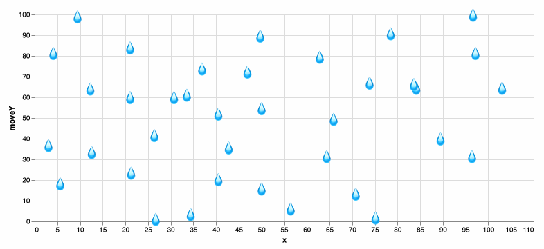
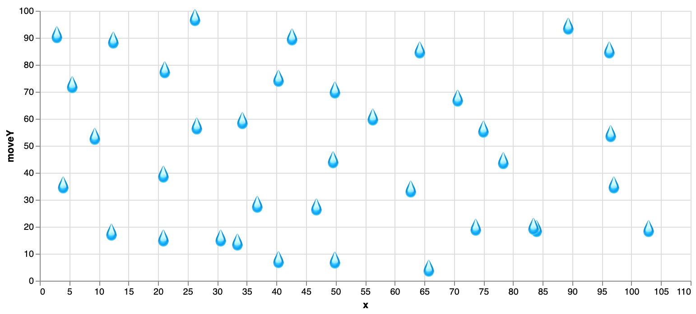
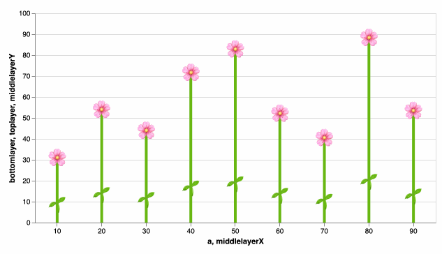
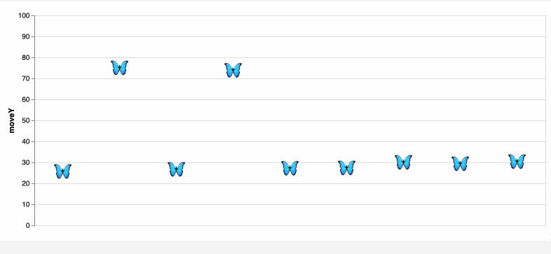

In December 2024, I participated in an internal hackathon at Datadog and explored animating graphs directly inside Datadog dashboards using [Vega-Lite](https://vega.github.io/). 

At the time, Datadog had just rolled out support for Vega-Lite, an open-source visualization grammar that allows allows users to create graphs that are not available within the native Datadog widget and query system. I wasn't familiar with [Vega or Vega-Lite](https://en.wikipedia.org/wiki/Vega_and_Vega-Lite_visualisation_grammars) before, so this was the perfect opportunity to dive in and learn the grammar. 


## First animation: The rain drop scatterplot 💧

I started with a simple [animated scatterplot of falling raindrops](https://vega.github.io/editor/#/url/vega-lite/N4IgJAzgxgFgpgWwIYgFwhgF0wBwqgegIDc4BzJAOjIEtMYBXAI0poHsDp5kTykBaADZ04JAKyUAVhDYA7EABoQOJACckCCGgDaoWRrhoQmGgkNK5O0HFKzMW1KEwBPHIfQmzqxcZiq22ILuAIwADAC+Sgw4ACZImO7GpnAAFLJsAO4pAJTZIOEAuoVKcZgojiDESIIMcA66IAAeRsEATJQAzKEA7N0+zkZdlKFiACzB+QqgzeitwcOtYgBs-UajAJyUS0vrYpPTRnMLy6uzS5StPev7TYOhlN07racgreeX3deRB+gdHZRiAAc6z6SgGZwB60WNxmIA65yhHQmYLW91GHUBfW+t3QowRrSRLwxAOCJ2xsLEoRewU2212MMO53GoQ6L0BlGChPJqJJrUB1PZYlJK256CW7UBlz2KNxEklfwZYrlING1IkI3GipAgNGHNCbxerVpOz2ou1-yBIKJ8zEUNNUxxIG6-x14utlBB3WeZpBHM+0pA4JAo26nSWwX5Zu6EjakpeS3ZnImZo2D3RKxlIDEcoJrLNHV1HVt8eN9LNby221BgaMS1D3Txqp9lFGmOemaWur5Gy1urCBszIbDEa1-x6OyJHK5DthwJbbZeurp9p+IDCY8e10zRsrZZnRnW522dfjOYVUfZeNJL2WFyuWsPLfXL19Dc7Wu69037Zr6E+u5XR1O06YtM0fD4vn3dBKTZeZPW9KCsyZZ9M26ODegQ1dRnuIU+TZM880Q0YJSlalQnueVCNXI4+TmNlBWFLU2gBTtkV-NdyOGMZk0QiRWLZC1GMKSJjHUWQIAAMzYVQECsEAoGqKAGEEeJEgAckAXg3AHKdtSfCQBwQEQNhJBoG4FMEJSVISFpyIAAgAalslJSgYBBKGcWz+FszxRDCUJslsgBSWy-Ic2yIBoWRnPiVz3NsgAqbzkgIPzyLyJR9KMBA2FIABNfICiUOBZCgNgYkisg0FAcFQAkmg4EEGIspyuB8qUFw3CMABHBgkDsOh4hoUgfGgap3FAGI2GQSKdFCBQ-KKESZlq+rGqMZp2tcRIer6kwyhMYaRIigAvcbKmqWo0EuESEkaTAqpAOqGqa9AjJMnwOsSdIEEi6p8hE5BVAAayMW77vCIA), which eventually inspired the rest of the dashboard (shown in the gif above).


## Step 1: Get the data
This graph used a basic dataset with about 40 points:

| x    | y   | 
| -------- | -------- | 
|12.3077|   30.0541|
|21.0256| 49.6695|
|21.0256| 26.2079|
|30.7692|26.2079|
|33.5897|26.5925|

Each point is represented with a 💧 emoji using Vega-Lite’s [text mark](https://vega.github.io/vega/docs/marks/text/).

```
"transform": [
    {
      "calculate": "'💧'",
      "as": "emoji"
    }
],
"mark": "text"
"encoding": {
    "x": {"type": "quantitative"},
    "y": {"type": "quantitative"},
    "size": {"value": 20},
    "text": {
      "field": "emoji",
      "type": "nominal"
    }
},
```
This gives us a static raindrop scatterplot.



## Step 2: Animate the drops
To make the raindrops "fall, I added a timer. It updates every 10ms and is the time that passed since  the visualization loaded. 

```jsx
{
  "name": "time", 
     "on": [{"events": {"type": "timer", "throttle": 10}, "update": "now()"}] 
}
```

Using this timer, I updated the Y position of each raindrop with a combination of modulo (%) and sine to create looping vertical movement with some variation in speed:

```jsx
"transform": [
    {
      "calculate": "100 + (datum.y - time/100) % 100 + sin(datum.y * time/10000)",
      "as": "moveY"
    }
  ]
```
And voilà, animated rain. [View code.](https://vega.github.io/editor/#/url/vega-lite/N4IgJAzgxgFgpgWwIYgFwhgF0wBwqgegIDc4BzJAOjIEtMYBXAI0poHsDp5kTykBaADZ04JAKyUAVhDYA7EABoQOJACckCCGgDaoWRrhoQmGgkNK5O0HFKzMW1KEwBPHIfQmzqxcZiq22ILuAIwADAC+Sgw4ACZImO7GpnAAFLJsAO4pAJTZIOEAuoVKcZgojiDESIIMcA66IAAeRsEATJQAzKEA7N0+zkZdlKFiACzB+QqgzeitwcOtYgBs-UajAJyUS0vrYpPTRnMLy6uzS5StPev7TYOhlN07racgreeX3deRB+gdHZRiAAc6z6SgGZwB60WNxmIA65yhHQmYLW91GHUBfW+t3QowRrSRLwxAOCJ2xsLEoRewU2212MMO53GoQ6L0BlGChPJqJJrUB1PZYlJK256CW7UBlz2KNxEklfwZYrlING1IkI3GipAgNGHNCbxerVpOz2ou1-yBIKJ8zEUNNUxxIG6-x14utlBB3WeZpBHM+0pA4JAo26nSWwX5Zu6EjakpeS3ZnImZo2D3RKxlIDEcoJrLNHV1HVt8eN9LNby221BgaMS1D3Txqp9lFGmOemaWur5Gy1urCBszIbDEa1-x6OyJHK5DthwJbbZeurp9p+IDCY8e10zRsrZZnRnW522dfjOYVUfZeNJL2WFyuWsPLfXL19Dc7Wu69037Zr6E+u5XR1O06YtM0fD4vn3dBKTZeZPW9KCsyZZ9M26ODegQ1dRnuIU+TZM880Q0YJSlalQnueVCNXI4+TmNlBWFLU2gBTtkV-NdyOGMZk0QiRWLZC1GMKSJjHUWQIAAMzYVQECsEAoGqKAGEEeJEgAckAXg3AHKdtSfCQBwQEQNhJBoG4FMEJSVISFpyIAAgAalslJSgYBBKGcWz+FszxRDCUJslsgBSWy-Ic2yIBoWRnPiVz3NsgAqbzkgIPzyLyJR9KMBA2FIABNfICiUOBZCgNgYkisg0FAcFQAkmg4EEGIspyuB8qUFw3CMABHBgkDsOh4hoUgfGgap3FAGI2GQSKdFCBQ-KKESZlq+rGqMZp2tcRIer6kwyhMYaRIigAvcbKmqWo0EuESEkaTAqpAOqGqa9AjJMnwOsSdIEEi6p8hE5BVAAayMW77vCIA)


## More animations

After the raindrops, I experimented with other animations, each using similar principles with different mathematical functions. I used [Graphtoy](https://graphtoy.com/?f1(x,t)=4%20+%204*smoothstep(0,0.7,sin(x+t))&v1=false&f2(x,t)=clamp((atan(((x/10.)%25100)/8-1)*60),%200,%20100)&v2=true&f3(x,t)=sqrt((x/10.)%25100)%20*%208&v3=true&f4(x,t)=((x%20-%20200)/10.)%25100&v4=true&f5(x,t)=(t%20+%20floor(x-t))/2%20-%205&v5=false&f6(x,t)=sin(f5(x,t))%20-%205&v6=false&grid=1&coords=521.7855192792142,66.89164551771165,597.4221734999295) to test and visualise the motion path. In the examples below, I created the motion that mimic balls being thrown and bouncing off the ground. Instead of just vertical motion, the points now move along parabolic paths.


Another animation using flower and leaf emojis. [View code.](https://vega.github.io/editor/#/url/vega-lite/N4IgJAzgxgFgpgWwIYgFwhgF0wBwqgegIDc4BzJAOjIEtMYBXAI0poHsDp5kTykBaADZ04JAKyUAVhDYA7EABoQAEzjQATjRyZ289AEEABBBoIcguIaZJ1h2DcyGA7nRiHETOMtXLDypJhUiiAuyvRoIFBygTSycOrBODZICBBoANqgsilwEToIuUpyGaBwpLKYaaigmACeOLno+fHB9Ops2BZoAIwADAC+Sgw4-piNIM0AFLJsTpMAlPMg-QC6q0qjKNUgxEiCDGolIFsgfcFMaADMAEyDoCfXvedoYmJ3xxGXT0oXqAAsl3eJz+3xAvwA7N0gRExKDfgAOKEKe4RABscJegORH3Q4IxqEuAE5oeh4fj4eCSSBCfixLc1kpMOokLIIAAzNjqBBHKB7KAMQQBcajBgIShMQwAakMk0mJlkkxFYolACoZc0CH1er1KPNDGqdd09QRDNc9WrLkslEgqhM2OYkLUWu9eYJ+YKxhEleKVTrrlLTcEbREEDRvBZBU71ABNZbY13uoVegKiygoa220PhuCR+IADTjoATAqT6G9EulsvlipTyv16tMoi1OvNhkNxtNrctQdtTA6mDYCFzCRdfJLnvQAHJADwbgA59yc9iKINiSGjdQuRMce8YzwCM+wuM0uECuaNdlislMOjsh1ABrNA1erjawJJRRQSciIAYlR8KYiMuYITAAL0aUoAA8cASdA-mWQYQDgWQomUWIyAfEBwPQtkaBzZQInTCYnwiGZQ2yQQg3AmgqlAQVPEEfRZDILpUAGeDaiwnDBDw9A+2wQcr0ZIj0AARwYFkdECHRSDg94b3vbY6gaPI4HAzAgJoUD0JUqCImuMQ4KURDkNQ9DMO2bDcPw1ohJAEjYj2CiqPQ2icwYpjGlYpR2PMzjuLtB0o2spSRLEio6ACGhpKUaA9jAlRByQWIMl6BQtTWeCxlUjjLPQZdV3XQTgtswd7PI-pyuxOT0MU8ZMrU6KNLi7ToJAPSDIQpC2BQxjTOyriQzDZQI0dfMgvGOyyMc6iQBc+jGOYzyQG80ALP69AsyGnMRpjMaIlE8Twqk3IMpUtSfJyhDj1XM9CvGkrJvK1Z+iAA)



## Happy accidents

As I was experimenting with making the butterflies move more naturally, I accidentally created this flickering effect.  I'm not exactly sure what caused it, but I liked the result and chose to keep it. [View code](https://vega.github.io/editor/#/url/vega-lite/N4IgJAzgxgFgpgWwIYgFwhgF0wBwqgegIDc4BzJAOjIEtMYBXAI0poHsDp5kTykBaADZ04JAKyUAVhDYA7EABoQAEzjQATjRyZ289AEEABBBoIcguIaZJ1h2DcyGA7nRiHETOMtXLDypJhUiiAuyvRoIFBygTSycOrBODZICBBoANqgsilwEQgAnlEMspjxwcRIggy56E42sgAUCDSCwhBwUbLKEA2ybE4NAJTDIAC+Clk5EToIuUpyGaBwpCVpqKCY+Tg1IDNlSvTqbNgWaACMAAwX4yAMOP6l06Zwvf1Dg2MAuqOfSg8o6xAFSqakWIABIEuwSYaAATAAOcagCGwi7QtBiMRI8ERADMaKUMNQABZcdiIcSCSAiQBOM7kiJiKlE+H0iY49AANmZGLJ7IhAHYeagzjSGeh4cL4QLxSAacKxLCfjdMOokLIIAAzNjqBBgqCVKAMQQBHYPBgIShMQwAakMDQaUR65st1oAVPa9gRLlcLpRBoYPX6zoG1V02AgGpdhoYCIZYTGPVClEg1iAEGxSAANMbsg2CI0mx7oJm2+2OtjOgIWq2Bz3Pb2+v0BoOUM4BuMJluGJnBVN5TNwACaudA+cLpoiAHJAHwbgGjdqd9tOINiSGhnL5KE35MqoTLpmwAazQGy2O1KAA9MMETAAvGpLC84BLoWFiMY3OCyKLKWJkE8gBeAGajQcCCMoA7ZsEmzbBEfTNNkgh9heNBrLIxqCDc+TAaB4GQcO0FnhEACODDqjogQ6KQN75g+KgRkgsQZBcCg+t8KpwFeOFgRB6ArmuG4HER6DwbElQfsqQA).



## Graphs using Datadog data

Some more visualisations I created using real Datadog data.


## Cross-graph animation

I also experimented with creating cross-graph animations. The idea was to split a single animation across multiple graphs in the same dashboard, so it looks like an object moves from one graph to another.


Initially, I tried to get the graphs within a dashboard to talk to each other, which is possible but requires more work. In the end, I opted for a simpler approach. Each graph renders a different segment of the animation’s X-axis. When loaded together, they appear as one continuous animation spread across panels.

Timing was critical as the effect only works if all graphs load simultaneously, which thankfully they did during my demo.


## Final thoughts 

This project was a creative exploration of what’s possible with Vega-Lite. From falling raindrops to animated butterflies, I had so much fun learning the  grammar and seeing how far I could push animation in visualizations beyond the standard use cases. Thank you for reading!


